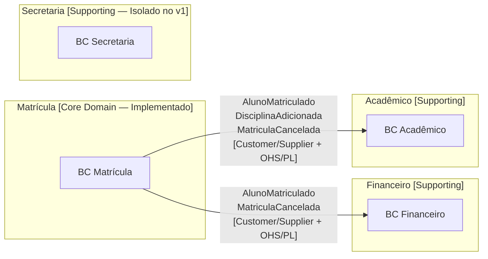
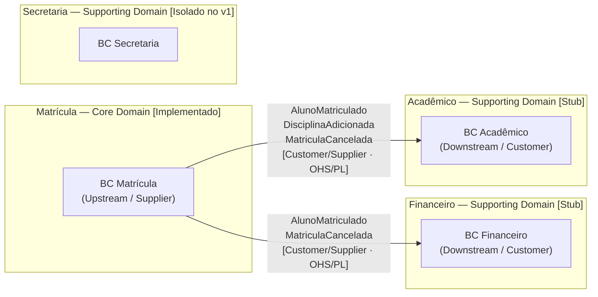

# Phase 1: Design Estrategico - Research

**Researched:** 2026-06-20
**Domain:** Documentação estratégica DDD — Markdown puro, sem código Java
**Confidence:** HIGH

---

<user_constraints>
## User Constraints (from CONTEXT.md)

### Locked Decisions

- **D-01:** Documentação fica em `docs/` separada por fase: `docs/01-design-estrategico/` para os documentos desta fase.
- **D-02:** `README.md` na raiz funciona como **mapa de navegação** — visão geral + links para cada documento. Sem conteúdo duplicado, sem seções DDD inline.
- **D-03:** Nomes de arquivo em **português descritivo**: `problema-negocio.md`, `linguagem-ubiqua.md`, `bounded-contexts.md`, `context-map.md`. (Sem prefixo numérico, sem mapeamento ESTR-XX.)
- **D-04:** ADRs ficam em `docs/adrs/` — pasta compartilhada por todas as fases, já que ADRs são decisões de projeto, não de fase.
- **D-05:** Estrutura de cada entrada do glossário: **tabela** com colunas `Termo | Definição | BC Dono | Não usar`.
- **D-06:** Adicionar coluna **"Não usar"** com anti-exemplos em inglês (ex: `StudentEntity`, `RegistrationDTO`). Reforça ativamente o uso da Linguagem Ubíqua.
- **D-07:** Após a tabela principal, seção separada **"Conceitos Ambíguos"** mostrando como o mesmo conceito (Aluno, Matrícula) é visto diferentemente em cada Bounded Context.
- **D-08:** O diagrama mostra **padrões DDD de relação rotulados**: Customer-Supplier entre Matrícula (upstream) e Financeiro/Acadêmico (downstream); Open Host Service + Published Language para os eventos; Anti-Corruption Layer nos consumidores.
- **D-09:** **Todos os 4 subdomínios** aparecem no mapa — Matrícula, Financeiro, Acadêmico, Secretaria. Secretaria aparece como contexto isolado (sem conexão com eventos de Matrícula no v1).
- **D-10:** **Os 3 eventos que cruzam fronteiras** são mostrados: `AlunoMatriculado`, `DisciplinaAdicionada`, `MatriculaCancelada`.
- **D-11:** ADRs **formais escritos já na Fase 1** (não adiados para a Fase 4). Os 4 ADRs planejados (DID-02..05) são entregues aqui: ADR-001 a ADR-004.
- **D-12:** Template ADR **clássico** (Michael Nygard): Status → Contexto → Decisão → Consequências (positivas e negativas). Ensina o formato enquanto documenta.
- **D-13:** Localização: `docs/adrs/ADR-001-mybatis-vs-jpa.md`, `ADR-002-escopo-bounded-context.md`, `ADR-003-referencia-por-id.md`, `ADR-004-codigo-em-portugues.md`.

### Claude's Discretion

- Profundidade de cada documento (ex: quantas frases por definição no glossário) — julgamento do agente durante a execução, priorizando clareza e concisão.
- Diagrama Mermaid: sintaxe exata (flowchart LR vs graph TD) — o que produzir renderização mais legível no GitHub.

### Deferred Ideas (OUT OF SCOPE)

None — a discussão se manteve dentro do escopo da Fase 1.

</user_constraints>

---

<phase_requirements>
## Phase Requirements

| ID | Description | Research Support |
|----|-------------|------------------|
| ESTR-01 | Documenta o problema de negócio da matrícula escolar — o que resolve, quem são os usuários e quais os fluxos principais | Fonte primária: `contexto-matricula.md` §1 (Core Domain, fluxos); documento `problema-negocio.md` |
| ESTR-02 | Glossário de Linguagem Ubíqua com termo, definição e responsável para cada conceito do domínio | Fonte primária: `contexto-matricula.md` §2 (Ubiquitous Language); 6 termos identificados + conceitos ambíguos |
| ESTR-03 | Subdomínios classificados e justificados como Core/Supporting/Generic | Fonte primária: `contexto-matricula.md` §1 (Core Domain, Subdomains); justificativas pedagógicas documentadas |
| ESTR-04 | Bounded Contexts documentados com responsabilidades, limites, linguagem própria e dados próprios | Fonte primária: `contexto-matricula.md` §1 (Bounded Contexts, conceito de Aluno por contexto) |
| ESTR-05 | Context Map em Mermaid com relações, dependências e fluxos de eventos | Fonte primária: `contexto-matricula.md` §1 (Context Map); sintaxe Mermaid verificada via pesquisa |
| ESTR-06 | Decisões arquiteturais com alternativas consideradas, vantagens, desvantagens e motivo da escolha final | Fonte primária: `.planning/research/STACK.md` (justificativas técnicas); 4 ADRs identificados |

</phase_requirements>

---

## Summary

Esta fase é **exclusivamente documental** — nenhum código Java, nenhum arquivo de configuração, apenas Markdown. O output é uma coleção de 7 arquivos: `README.md` (raiz), 4 documentos em `docs/01-design-estrategico/`, e 4 ADRs em `docs/adrs/`. Todo o conteúdo substancial já existe em `contexto-matricula.md` e nas pesquisas de `.planning/research/` — o trabalho desta fase é organizar, estruturar e estender esse material para a audiência pedagógica (desenvolvedores vindos de arquitetura em camadas).

O desafio central não é descoberta de conteúdo, mas **pedagogia**: cada documento deve seguir a sequência problema → solução → consequências, nunca definição isolada. O ponto de tensão mais importante é o conceito de "Aluno muda conforme o contexto" — é o exemplo mais poderoso para demonstrar por que Bounded Contexts existem, e deve aparecer com destaque nos documentos `linguagem-ubiqua.md` e `bounded-contexts.md`.

Os ADRs desta fase entregam antecipadamente os requisitos DID-02..05 (previstos no ROADMAP para a Fase 4). Isso é intencional: decisões arquiteturais são mais pedagógicas quando lidas junto ao Design Estratégico, antes do código existir.

**Primary recommendation:** Usar `graph LR` (horizontal) para o Context Map no GitHub — melhor legibilidade com 4+ nós. Para diagramas menores (fluxos), `flowchart TD` (vertical) funciona melhor.

---

## Architectural Responsibility Map

Esta fase não tem camadas de software — é documentação pura. O mapa abaixo reflete a responsabilidade pedagógica de cada documento.

| Capability | Documento Responsável | Seção Específica | Rationale |
|------------|----------------------|-----------------|-----------|
| Problema de negócio | `problema-negocio.md` | Visão geral + usuários + fluxos | Âncora: por que DDD existe neste domínio |
| Linguagem ubíqua | `linguagem-ubiqua.md` | Glossário + Conceitos Ambíguos | Base compartilhada — outros documentos referenciam estes termos |
| Classificação de subdomínios | `bounded-contexts.md` | §Subdomínios | Core/Supporting/Generic com justificativa explícita |
| Limites dos contextos | `bounded-contexts.md` | §Bounded Contexts | Responsabilidades, dados próprios, linguagem própria por contexto |
| Mapa de relações | `context-map.md` | Diagrama Mermaid + narrativa | Padrões DDD rotulados (Customer-Supplier, OHS, PL, ACL) |
| Decisões arquiteturais | `docs/adrs/*.md` | 4 ADRs (formato Nygard) | Evidência do raciocínio — lidos uma vez, consultados sempre |
| Navegação geral | `README.md` | Links + sumário de contexto | Ponto de entrada; sem conteúdo duplicado |

---

## Standard Stack

### Para esta fase: ferramentas de autoria

| Ferramenta | Versão | Propósito | Por que padrão |
|-----------|--------|-----------|---------------|
| Markdown | — | Formato de todos os documentos | Decisão locked (CLAUDE.md) |
| Mermaid | Suportado pelo GitHub (sem versão explícita) | Diagramas inline no Markdown | Sem ferramentas externas (CLAUDE.md) |
| Git | Instalado no projeto | Versionamento dos arquivos | Workflow padrão |

Não há dependências de runtime, biblioteca ou pacote nesta fase. Zero instalações necessárias.

### Sintaxe Mermaid verificada para Context Map

**Opção recomendada: `graph LR` com subgraph por contexto** [ASSUMED — baseado em comportamento documentado do Mermaid no GitHub]



**Nota sobre Secretaria:** Aparece no diagrama como contexto isolado, sem setas de evento. Isso representa corretamente a decisão de que a Secretaria existe como subdomínio mas não recebe eventos de Matrícula no v1. [VERIFIED: 01-CONTEXT.md D-09]

**Rótulos de padrões DDD no diagrama:**
- `[Customer/Supplier]` — Matrícula (upstream/supplier) dita o contrato; Financeiro/Acadêmico (downstream/customer) adaptam-se
- `[OHS/PL]` — Open Host Service + Published Language: os eventos (`AlunoMatriculado` etc.) são a interface pública estável
- `[ACL]` — Anti-Corruption Layer: mencionado na narrativa do `context-map.md`, não no diagrama (evita excesso visual)

---

## Package Legitimacy Audit

Não aplicável — esta fase não instala nenhum pacote de software.

---

## Architecture Patterns

### Estrutura de arquivos a criar

```
(raiz do projeto)/
├── README.md                                    # Mapa de navegação (novo ou substituição)
└── docs/
    ├── 01-design-estrategico/
    │   ├── problema-negocio.md                  # ESTR-01
    │   ├── linguagem-ubiqua.md                  # ESTR-02
    │   ├── bounded-contexts.md                  # ESTR-03 + ESTR-04
    │   └── context-map.md                       # ESTR-05
    └── adrs/
        ├── ADR-001-mybatis-vs-jpa.md            # ESTR-06 / DID-02
        ├── ADR-002-escopo-bounded-context.md    # ESTR-06 / DID-03
        ├── ADR-003-referencia-por-id.md         # ESTR-06 / DID-04
        └── ADR-004-codigo-em-portugues.md       # ESTR-06 / DID-05
```

`docs/` ainda não existe no projeto — deve ser criada nesta fase.

### Padrão 1: Template ADR Nygard (clássico)

Cada ADR deve seguir exatamente esta estrutura de seções:

```markdown
# ADR-00X: [Título em Português]

**Status:** Aceito
**Data:** 2026-06-20
**Contexto:** Fase 1 — Design Estratégico

## Contexto

[Descrição do problema que motivou a decisão. O "porquê" existe antes de mencionar a solução.]

## Alternativas Consideradas

### Opção A: [Nome]
[Descrição + prós e contras]

### Opção B: [Nome]
[Descrição + prós e contras]

## Decisão

[A decisão tomada, em linguagem direta. Ex: "Usamos MyBatis (não JPA/Hibernate)."]

## Consequências

### Positivas
- [Benefício 1]
- [Benefício 2]

### Negativas (Trade-offs)
- [Custo 1]
- [Custo 2]

## Referências
- [Link para documentação ou fonte]
```

[CITED: Architecture Decision Records by Michael Nygard — https://cognitect.com/blog/2011/11/15/documenting-architecture-decisions]

**Ponto pedagógico:** A seção "Negativas" é obrigatória. ADRs sem trade-offs honestamente documentados não são pedagógicos — parecem propaganda da tecnologia escolhida.

### Padrão 2: Estrutura do README.md (mapa de navegação)

O README não deve conter seções DDD inline (sem definir o que é DDD, sem glossário embutido). Deve funcionar como índice:

```markdown
# ERP Matrícula — Projeto Didático DDD

## O que é este projeto
[2-3 frases: projeto de treinamento, domínio escolhido, audiência]

## Por onde começar
[Caminho sugerido de leitura — links sequenciais]

## Documentação por fase

### Fase 1: Design Estratégico
- [Problema de Negócio](docs/01-design-estrategico/problema-negocio.md)
- [Linguagem Ubíqua](docs/01-design-estrategico/linguagem-ubiqua.md)
- [Bounded Contexts](docs/01-design-estrategico/bounded-contexts.md)
- [Context Map](docs/01-design-estrategico/context-map.md)

### Decisões Arquiteturais (ADRs)
- [ADR-001: MyBatis vs JPA](docs/adrs/ADR-001-mybatis-vs-jpa.md)
- [ADR-002: Escopo do Bounded Context](docs/adrs/ADR-002-escopo-bounded-context.md)
- [ADR-003: Referência por ID](docs/adrs/ADR-003-referencia-por-id.md)
- [ADR-004: Código em Português](docs/adrs/ADR-004-codigo-em-portugues.md)

## Stack
[Lista concisa: Java 21, Spring Boot 3.5.3, MyBatis 3.0.5, PostgreSQL, Docker]

## Como executar
[Placeholder — será preenchido nas Fases 3-4]
```

### Padrão 3: Estrutura do Glossário de Linguagem Ubíqua

Cada entrada da tabela principal:

```markdown
| Termo | Definição | BC Dono | Não usar |
|-------|-----------|---------|----------|
| Aluno | Pessoa física que se matricula em uma turma para cursar disciplinas em um período letivo. No BC Matrícula, o que importa é se pode se matricular (está ativo, sem impedimentos). | Matrícula | `StudentEntity`, `StudentDTO`, `User` |
```

Seguida de seção "Conceitos Ambíguos" com tabela mostrando como o mesmo termo tem significados diferentes por contexto:

```markdown
## Conceitos Ambíguos

### Aluno

| Contexto | O que "Aluno" significa neste contexto | Dados relevantes |
|----------|----------------------------------------|-----------------|
| Matrícula | Pode se matricular? Está ativo? Tem impedimentos? | status ativo, ausência de matrícula duplicada no período |
| Financeiro | Possui débitos? Tem bolsa? | contratos, mensalidades, situação financeira |
| Acadêmico | Está cursando quais disciplinas? Qual seu histórico? | notas, frequência, disciplinas cursadas |
```

[CITED: contexto-matricula.md §1 — "O conceito de Aluno muda conforme o contexto"]

### Padrão 4: Estrutura do Context Map (narrativa + diagrama)

O `context-map.md` deve ter duas partes complementares:

1. **Diagrama Mermaid** (legível visual imediato)
2. **Narrativa explicativa** descrevendo cada relação em prosa, com os padrões DDD nomeados

Exemplo de narrativa:

```markdown
### Matrícula → Financeiro

**Padrão:** Customer/Supplier + Open Host Service + Published Language

Matrícula é o contexto **upstream** (Supplier): define os eventos de domínio que outros contextos
podem consumir. Financeiro é o contexto **downstream** (Customer): adapta seu comportamento
quando recebe eventos de Matrícula.

Os eventos `AlunoMatriculado` e `MatriculaCancelada` são a **linguagem publicada** (Published Language)
— contratos estáveis que Matrícula se compromete a manter.

Financeiro implementa uma **Anti-Corruption Layer** (ACL): ao receber `AlunoMatriculado`,
traduz para seus próprios conceitos (ex: `CriarContrato`) sem deixar que o modelo de Matrícula
contamine seu domínio interno.
```

### Anti-Patterns a Evitar

- **Duplicação de conteúdo:** README não deve copiar o glossário — apenas linkar. Cada informação tem um único lugar.
- **ADR sem trade-offs:** Toda decisão tem custo. Documentar "Negativas" não é fraqueza — é honestidade pedagógica.
- **Glossário sem anti-exemplos:** A coluna "Não usar" é obrigatória (D-06). É o diferencial que reforça a Linguagem Ubíqua ativamente.
- **Context Map sem rótulos de padrão:** Setas sem rótulo não ensinam DDD — são só diagramas de caixas. Cada relação deve ser nomeada (Customer/Supplier, OHS/PL, ACL).
- **Bounded Contexts descritos como camadas técnicas:** "Financeiro é o módulo de cobrança" é errado. "Financeiro é o contexto responsável pela relação financeira com o aluno — define o que é um devedor, o que é uma bolsa" é correto.

---

## Don't Hand-Roll

| Problema | Não construir | Usar em vez disso | Por que |
|----------|---------------|-------------------|---------|
| Diagramas | Ferramentas externas (Draw.io, Lucidchart) | Mermaid inline no Markdown | Decisão locked em CLAUDE.md; funciona no GitHub sem instalação |
| ADR format | Template inventado | Template Nygard clássico (Status/Contexto/Decisão/Consequências) | Formato consolidado, reconhecível, pedagógico |
| Conteúdo do domínio | Reinventar regras de negócio | `contexto-matricula.md` como fonte primária | Todo o domínio já está documentado lá |
| Justificativas técnicas dos ADRs | Pesquisa nova | `.planning/research/STACK.md` e `.planning/research/PITFALLS.md` | Pesquisa já feita com fontes verificadas |

---

## Common Pitfalls

### Pitfall 1: ADR-001 sem código "antes/depois"

**O que vai errado:** O ADR explica que JPA "contamina o domínio com anotações" sem mostrar o que isso significa concretamente.

**Por que acontece:** É mais fácil escrever prosa do que montar um exemplo de código inline no Markdown.

**Como evitar:** O CONTEXT.md (específics) explicitamente requer um exemplo de código `@Entity`/`@Id` invadindo o modelo de domínio. ADR-001 DEVE incluir este bloco:

```java
// COM JPA — anotações de persistência no modelo de domínio (problema)
@Entity
@Table(name = "matriculas")
public class Matricula {
    @Id
    @GeneratedValue
    private UUID id;

    @OneToMany(cascade = CascadeType.ALL)
    private List<ItemMatricula> itens;
    // O domínio agora depende do framework de persistência
}

// COM MYBATIS — modelo de domínio limpo (decisão tomada)
public class Matricula {
    private final MatriculaId id;
    private final List<ItemMatricula> itens;
    // Zero imports de framework — puro Java
}
```

**Sinal de alerta:** Se o ADR-001 não tem bloco de código, não cumpre seu papel pedagógico.

---

### Pitfall 2: Glossário com definições de dicionário

**O que vai errado:** "Aluno: pessoa que estuda em uma escola." Isso não ajuda ninguém.

**Por que acontece:** Definições de dicionário são fáceis de escrever.

**Como evitar:** Cada definição deve responder: "O que é importante sobre este conceito NESTE contexto específico?"

Exemplo ruim: "Matrícula: ato de registrar um aluno em uma turma."
Exemplo bom: "Matrícula: Aggregate Root do sistema. Representa o vínculo de um Aluno a um PeriodoLetivo, com zero ou mais disciplinas escolhidas. Protege as invariantes: limite de disciplinas, não duplicidade, não adição após cancelamento."

---

### Pitfall 3: Context Map com Secretaria conectada incorretamente

**O que vai errado:** O diagrama mostra Secretaria recebendo eventos de Matrícula (porque "faz sentido" operacionalmente).

**Por que acontece:** Na realidade escolar, a Secretaria lida com matrículas o tempo todo. Parece errado isolá-la.

**Como evitar:** A decisão D-09 é explícita — Secretaria aparece como contexto isolado no v1, sem setas de evento vindo de Matrícula. Isso deve ser explicado em nota no `context-map.md`: "Secretaria existe como subdomínio separado mas não integra-se com eventos de Matrícula no v1 — esta integração seria escopo da v2."

---

### Pitfall 4: bounded-contexts.md confundindo Subdomínio com Bounded Context

**O que vai errado:** Os termos são usados como sinônimos quando têm significados distintos em DDD.

**Como evitar:** O documento deve explicar explicitamente a diferença:
- **Subdomínio**: partição do problema de negócio (o "o quê" — Matrícula é o problema de vincular alunos a turmas)
- **Bounded Context**: partição da solução (o "como" — o software que implementa a lógica de matrícula)

Neste projeto, o mapeamento é 1:1 (cada subdomínio tem um BC correspondente), mas o documento deve declarar isso explicitamente em vez de assumir que o leitor sabe a diferença.

---

### Pitfall 5: README com conteúdo DDD inline

**O que vai errado:** O README começa a definir o que é um Aggregate Root, o que é um Value Object, etc.

**Por que acontece:** Parece natural usar o README para apresentar o projeto DDD.

**Como evitar:** A decisão D-02 é explícita — README é mapa de navegação, sem seções DDD inline. O conteúdo vai nos documentos específicos; o README só linka.

---

## Code Examples

### Exemplo 1: Estrutura de tabela do Glossário (Mermaid não — Markdown)

```markdown
| Termo | Definição | BC Dono | Não usar |
|-------|-----------|---------|----------|
| Aluno | Pessoa física matriculável. No BC Matrícula: representa elegibilidade (ativo? sem impedimentos?). Referenciado por `AlunoId` — o BC Matrícula não carrega dados completos do aluno. | Matrícula | `StudentEntity`, `Student`, `Usuario` |
| Turma | Oferta de um conjunto de disciplinas em um PeriodoLetivo, com capacidade máxima (vagas). Referenciada por `TurmaId`. | Matrícula | `Class`, `CourseGroup`, `TurmaEntity` |
| Matrícula | Vínculo de um Aluno a um PeriodoLetivo. Aggregate Root: protege invariantes de consistência (limite de disciplinas, não duplicidade, não adição após cancelamento). | Matrícula | `Enrollment`, `Registration`, `MatriculaEntity` |
| PeriodoLetivo | Par (ano + semestre) que identifica quando uma matrícula ocorre. Value Object: imutável, validado no construtor. Ex: 2026-1. | Matrícula | `Semester`, `Term`, `Period` |
| Vaga | Slot disponível em uma Turma. Representa a capacidade restante de um conjunto de disciplinas. | Matrícula | `Slot`, `Seat`, `AvailableSpot` |
| Responsável Financeiro | Pessoa física ou jurídica responsável pelo pagamento das mensalidades do Aluno. Relevante para o BC Financeiro; no BC Matrícula existe apenas como referência. | Financeiro | `Payer`, `Guardian`, `FinancialContact` |
```

[CITED: contexto-matricula.md §2 — Ubiquitous Language]

### Exemplo 2: Diagrama Context Map completo



[ASSUMED — sintaxe `subgraph` com espaços e caracteres especiais em rótulos pode variar; testar no GitHub após criação]

### Exemplo 3: Seção de Conceitos Ambíguos

```markdown
## Conceitos Ambíguos

O mesmo termo pode ter significados diferentes dependendo do contexto.
Este é um dos insights centrais do DDD: a Linguagem Ubíqua é **local** ao Bounded Context.

### Aluno

| Contexto | O que importa sobre o Aluno | Dados que o BC mantém |
|----------|-----------------------------|-----------------------|
| **Matrícula** | Pode se matricular? Está ativo? Já tem matrícula neste período? | `AlunoId`, status ativo/inativo |
| **Financeiro** | Tem mensalidades em aberto? Possui bolsa de estudos? Qual o contrato vigente? | histórico de pagamentos, contratos, bolsas |
| **Acadêmico** | Está cursando quais disciplinas? Qual é seu histórico de notas e frequência? | disciplinas cursadas, notas, frequência |

> **Lição:** "Aluno" no BC Matrícula e "Aluno" no BC Acadêmico são modelos diferentes,
> mantidos por equipes diferentes, com ciclos de evolução independentes.
> Compartilhar uma única classe `Aluno` entre os três contextos criaria acoplamento
> e impediria que cada contexto evoluísse no seu próprio ritmo.
```

[CITED: contexto-matricula.md §1 — "O conceito de Aluno muda conforme o contexto"]

### Exemplo 4: Classificação de subdomínios (bounded-contexts.md)

```markdown
## Classificação de Subdomínios

| Subdomínio | Tipo | Justificativa |
|------------|------|---------------|
| **Matrícula** | Core Domain | É a operação central da instituição. Sem matrícula, não existe aluno ativo, não existe cobrança, não existe vínculo acadêmico. As regras de matrícula são o diferencial competitivo — nenhum sistema genérico as captura com a mesma fidelidade. |
| **Financeiro** | Supporting Domain | Importante, mas não é o diferencial da instituição. As regras de cobrança e contrato existem em outros tipos de negócio. Poderia ser delegado a um sistema de terceiros sem perda de identidade. |
| **Acadêmico** | Supporting Domain | Gestão de notas, frequência e histórico é essencial para o funcionamento, mas não é onde a instituição se diferencia. Sistemas de gestão acadêmica existem prontos no mercado. |
| **Secretaria** | Supporting Domain | Processos administrativos de suporte. Amplamente genérico — pode ser terceirizado ou adquirido. |
| **Autenticação** | Generic Domain | Problema completamente resolvido pelo mercado (OAuth2, LDAP, Keycloak). Construir internamente é desperdício de tempo de engenharia do Core Domain. |
| **Notificações/E-mail** | Generic Domain | Infraestrutura de comunicação. Nenhuma regra de negócio específica da instituição. |
```

[CITED: contexto-matricula.md §1 — Core Domain, Subdomains]

### Exemplo 5: ADR-001 — estrutura com código "antes/depois"

```markdown
# ADR-001: MyBatis em vez de JPA/Hibernate

**Status:** Aceito
**Data:** 2026-06-20

## Contexto

Em projetos Java com banco relacional, a escolha padrão é JPA/Hibernate via Spring Data JPA.
Esta é a primeira decisão técnica que contradiz o padrão de mercado — e precisa ser explicada.

O problema com JPA em projetos DDD:

```java
// COM JPA: anotações de persistência no modelo de domínio
@Entity
@Table(name = "matriculas")
public class Matricula {
    @Id @GeneratedValue(strategy = GenerationType.UUID)
    private UUID id;
    @OneToMany(cascade = CascadeType.ALL, fetch = FetchType.LAZY)
    @JoinColumn(name = "matricula_id")
    private List<ItemMatricula> itens;
}
// O domínio agora importa jakarta.persistence.* — depende do framework
```

O modelo de domínio passou a conhecer detalhes de persistência (`fetch = LAZY`,
`cascade = ALL`). Isso viola um princípio fundamental do DDD: o domínio deve ser
independente de qualquer framework.

## Alternativas Consideradas
...
```

---

## State of the Art

Esta fase é documentação — não há dependências de framework com versões variáveis. Registros relevantes sobre o estado atual de Mermaid no GitHub:

| Aspecto | Estado Atual | Impacto |
|---------|-------------|---------|
| Mermaid no GitHub | Suportado nativamente em todos os Markdown | Diagramas renderizam sem plugins adicionais |
| `graph LR` vs `flowchart LR` | Ambos funcionam; `flowchart` é a sintaxe mais nova | Usar `graph LR` por compatibilidade mais ampla |
| Rótulos com quebra de linha em setas | `"linha1\nlinha2"` funciona no Mermaid atual | Usar para listar múltiplos eventos em uma seta |
| Subgraphs com espaços no ID | Requer aspas: `subgraph MAT["Texto"]` | Testar após criar |

[ASSUMED — comportamento específico de versão Mermaid no GitHub pode variar; verificar após criar os arquivos]

---

## Assumptions Log

| # | Claim | Section | Risk if Wrong |
|---|-------|---------|---------------|
| A1 | `graph LR` com subgraphs renderiza corretamente no GitHub com rótulos longos em setas | Architecture Patterns (Context Map) | Diagrama ilegível — ajustar para `graph TD` ou simplificar rótulos |
| A2 | Sintaxe `"AlunoMatriculado\nDisciplinaAdicionada"` em setas Mermaid renderiza quebra de linha no GitHub | Code Examples (Context Map) | Texto aparece em linha única — usar lista ou tabela separada |
| A3 | Caracteres especiais em português (ã, ç, é) são suportados em rótulos Mermaid no GitHub | Architecture Patterns | Usar transliteração (sem acentos) como fallback se necessário |

**Mitigação geral para A1-A3:** Após criar os arquivos, abrir no GitHub e verificar renderização. Ajustes de sintaxe Mermaid são rápidos.

---

## Open Questions

1. **README.md já existe?**
   - O que sabemos: A raiz do projeto tem `CLAUDE.md`, `contexto-matricula.md`, `prompt-estudo-ddd.md` — sem `README.md` ainda.
   - O que está claro: Criar um README.md novo (não há conteúdo a preservar).
   - Recomendação: Criar do zero seguindo o padrão de mapa de navegação (D-02).

2. **`docs/` não existe — criar ou verificar permissão**
   - O que sabemos: `ls` confirma que não há diretório `docs/` na raiz.
   - Recomendação: O agente de execução cria `docs/01-design-estrategico/` e `docs/adrs/` como parte do trabalho — sem impedimento.

3. **Ordem dos eventos no Context Map para Acadêmico**
   - O que sabemos: `AlunoMatriculado` e `MatriculaCancelada` aparecem em `contexto-matricula.md`. `DisciplinaAdicionada` aparece nas decisões (D-10).
   - O que está claro: Acadêmico deve receber `AlunoMatriculado`, `DisciplinaAdicionada`, e `MatriculaCancelada` (todos os 3 fazem sentido para o contexto acadêmico).
   - Recomendação: Incluir os 3 eventos para Acadêmico conforme D-10.

---

## Environment Availability

Step 2.6: SKIPPED — fase cria apenas arquivos Markdown. Sem dependências de runtime, CLI externo, banco de dados ou serviço.

O único "ambiente" necessário é o editor de texto/git, já disponível (git status confirmado no início da sessão).

---

## Validation Architecture

`workflow.nyquist_validation` está explicitamente `false` em `.planning/config.json` — seção omitida conforme instrução.

---

## Security Domain

Esta fase cria apenas documentação Markdown estática sem dados sensíveis, endpoints, autenticação ou persistência. Não há vetor de ataque — seção omitida.

---

## Content Specification per Document

Esta seção detalha o conteúdo esperado de cada arquivo, para que o planner crie tarefas precisas.

### `README.md` (raiz)

**Propósito:** Mapa de navegação.

**Seções:**
1. Título + tagline (1 linha)
2. "O que é este projeto" (3-4 frases: treinamento DDD, domínio matrícula escolar, audiência, propósito autônomo)
3. "Por onde começar" — caminho de leitura sugerido (links sequenciais)
4. "Documentação por fase" — links para todos os docs (expandirá a cada fase)
5. "Decisões Arquiteturais (ADRs)" — links para os 4 ADRs
6. "Stack técnico" — lista: Java 21, Spring Boot 3.5.3, MyBatis 3.0.5, PostgreSQL, Docker, Maven
7. "Como executar" — placeholder: "Instruções na Fase 3"

**Não incluir:** Definições de DDD, glossário, diagramas de arquitetura, código Java.

---

### `docs/01-design-estrategico/problema-negocio.md` (ESTR-01)

**Propósito:** Âncora do "por que DDD existe neste domínio".

**Seções:**
1. "O que o sistema resolve" — descrição do problema de negócio da matrícula escolar em linguagem de negócio (não técnica)
2. "Quem são os usuários" — tabela: Secretaria, Aluno, Responsável Financeiro, Coordenador Acadêmico
3. "Fluxos principais" — os 3 fluxos do projeto: Realizar Matrícula, Adicionar Disciplina, Cancelar Matrícula (descrição em prosa, sem código)
4. "Por que DDD para este domínio" — argumentação: regras complexas, múltiplos contextos com o mesmo conceito, eventos que cruzam fronteiras

**Fonte de conteúdo:** `contexto-matricula.md` §1 (início), regras de negócio descobertas no §4.

---

### `docs/01-design-estrategico/linguagem-ubiqua.md` (ESTR-02)

**Propósito:** Glossário compartilhado entre especialistas e código.

**Seções:**
1. Introdução (2 parágrafos): o que é Linguagem Ubíqua e por que o código usa termos em português
2. "Glossário" — tabela com colunas `Termo | Definição | BC Dono | Não usar` (mínimo 6 termos: Aluno, Turma, Matrícula, PeriodoLetivo, Vaga, Responsável Financeiro)
3. "Conceitos Ambíguos" — sub-tabelas mostrando Aluno e Matrícula por contexto

**Termos obrigatórios e suas definições-fonte:**
- Aluno → `contexto-matricula.md` §1 "Matrícula / pode se matricular?"
- Turma → vagas, período letivo, conjunto de disciplinas
- Matrícula → Aggregate Root, invariantes
- PeriodoLetivo → Value Object, par ano+semestre
- Vaga → capacidade disponível em Turma
- Responsável Financeiro → BC Financeiro, pagador

---

### `docs/01-design-estrategico/bounded-contexts.md` (ESTR-03 + ESTR-04)

**Propósito:** Classificar subdomínios e definir fronteiras de cada contexto.

**Seções:**
1. "Subdomínios" — tabela de classificação (Core/Supporting/Generic) com justificativa por linha
2. "Bounded Contexts" — seção por contexto:
   - **BC Matrícula** (único implementado): responsabilidade, limites, linguagem própria, dados próprios, regras-chave
   - **BC Financeiro** (stub): responsabilidade, o que consome de Matrícula
   - **BC Acadêmico** (stub): responsabilidade, o que consome de Matrícula
   - **BC Secretaria** (isolado no v1): responsabilidade, por que não integra com Matrícula no v1
3. "O Aluno em cada contexto" — remissão ao documento `linguagem-ubiqua.md §Conceitos Ambíguos`

**Nota crítica:** Distinguir explicitamente Subdomínio (partição do problema) de Bounded Context (partição da solução).

---

### `docs/01-design-estrategico/context-map.md` (ESTR-05)

**Propósito:** Mostrar como os contextos se relacionam e quais eventos cruzam fronteiras.

**Seções:**
1. Diagrama Mermaid (Context Map com 4 contextos, padrões rotulados)
2. "Padrões de Relacionamento" — explicação de cada padrão DDD usado:
   - Customer/Supplier
   - Open Host Service (OHS)
   - Published Language (PL)
   - Anti-Corruption Layer (ACL)
3. "Eventos que cruzam fronteiras" — tabela: Evento | Publicado por | Consumido por | Propósito
4. "Secretaria no v1" — nota explicativa sobre o isolamento intencional

**Tabela de eventos (conteúdo esperado):**

| Evento | Publicado por | Consumido por | Propósito |
|--------|--------------|--------------|-----------|
| `AlunoMatriculado` | BC Matrícula | BC Financeiro, BC Acadêmico | Financeiro gera contrato; Acadêmico cria vínculo acadêmico |
| `DisciplinaAdicionada` | BC Matrícula | BC Acadêmico | Acadêmico reserva vaga na disciplina |
| `MatriculaCancelada` | BC Matrícula | BC Financeiro, BC Acadêmico | Financeiro cancela contrato; Acadêmico libera vagas |

[CITED: contexto-matricula.md §1 — Context Map; 01-CONTEXT.md D-10]

---

### `docs/adrs/ADR-001-mybatis-vs-jpa.md` (ESTR-06 / DID-02)

**Decisão:** Usar MyBatis (não JPA/Hibernate)

**Conteúdo obrigatório:**
- Exemplo de código "antes" (JPA com `@Entity`, `@Id`, `@OneToMany`) — [CITED: 01-CONTEXT.md §specifics]
- Exemplo de código "depois" (MyBatis com classe de domínio limpa)
- Alternativas: JPA, Spring Data JDBC, JDBC puro
- Trade-off honesto: "MyBatis exige mais XML/código de mapeamento escrito manualmente"

**Fontes de conteúdo:** `.planning/research/STACK.md` §"Configuração Spring Boot: Evitando Vazamento de Infraestrutura"; `.planning/research/PITFALLS.md` §"Infrastructure Leakage"

---

### `docs/adrs/ADR-002-escopo-bounded-context.md` (ESTR-06 / DID-03)

**Decisão:** Implementar apenas o BC Matrícula; Financeiro e Acadêmico existem como stubs

**Conteúdo obrigatório:**
- Problema: implementar integração real entre BCs adiciona complexidade de infraestrutura (messaging, contratos de API) antes que os padrões táticos estejam consolidados
- Alternativas: implementar Financeiro parcialmente; implementar via REST entre serviços
- Trade-off: "O leitor não vê integração real entre contextos — perde a experiência de consistência eventual"

**Fonte:** `.planning/research/FEATURES.md` §"Anti-Features — Contextos Financeiro e Acadêmico Implementados"

---

### `docs/adrs/ADR-003-referencia-por-id.md` (ESTR-06 / DID-04)

**Decisão:** `Matricula` referencia `Aluno` por `AlunoId`, não por objeto `Aluno`

**Conteúdo obrigatório:**
- Exemplo de código: `class Matricula { AlunoId alunoId; }` vs `class Matricula { Aluno aluno; }`
- Problema que resolve: evita carregar aggregate de outro BC para operações que não precisam
- Problema de boundary: FK relacional entre tabelas de BCs diferentes
- Trade-off: "O Application Service precisa carregar `Aluno` separadamente quando ambos são necessários — mais código de orquestração"

**Fonte:** `.planning/research/STACK.md` §"Por que aluno_id UUID em vez de FOREIGN KEY"; contexto-matricula.md §15

---

### `docs/adrs/ADR-004-codigo-em-portugues.md` (ESTR-06 / DID-05)

**Decisão:** Código Java, SQL e nomes de arquivo em português

**Conteúdo obrigatório:**
- Contraste: `matriculaRepositorio.buscarPorId()` vs `matriculaRepository.findById()`
- Argumento: Linguagem Ubíqua não é opcional — tradução cria barreira cognitiva entre especialista de domínio e desenvolvedor
- Alternativas: inglês técnico (padrão de mercado); inglês para código, português para docs
- Trade-offs: "Ferramentas de análise estática, AI assistants e Stack Overflow funcionam melhor com inglês — o desenvolvedor paga esse custo"

**Fonte:** `.planning/research/FEATURES.md` §"Linguagem Ubíqua Aplicada Consistentemente no Código"

---

## Sources

### Primary (HIGH confidence)
- `contexto-matricula.md` — fonte primária de todo conteúdo de domínio (subdomínios, linguagem ubíqua, bounded contexts, context map, regras de negócio)
- `01-CONTEXT.md` — decisões locked D-01..D-13 que constrangem este research
- `.planning/REQUIREMENTS.md` §ESTR-01..06 — critérios de aceite dos requisitos desta fase
- `.planning/research/STACK.md` — justificativas técnicas para ADR-001 (MyBatis vs JPA) com fontes verificadas
- `.planning/research/PITFALLS.md` — armadilhas pedagógicas e anti-padrões para os ADRs

### Secondary (MEDIUM confidence)
- `.planning/research/FEATURES.md` — justificativas para anti-features (ADR-002, escopo dos stubs)
- `.planning/research/ARCHITECTURE.md` — estrutura de pacotes e context map de código (referência para ADRs)
- ADR format: Michael Nygard — https://cognitect.com/blog/2011/11/15/documenting-architecture-decisions

### Tertiary (LOW confidence)
- Comportamento específico de renderização Mermaid no GitHub — [ASSUMED]; verificar após criação dos arquivos

---

## Metadata

**Confidence breakdown:**
- Conteúdo de domínio (glossário, contextos, eventos): HIGH — fonte primária `contexto-matricula.md` verificada e completa
- Estrutura de documentos (templates, seções): HIGH — derivada de CONTEXT.md + padrões estabelecidos (ADR Nygard)
- Sintaxe Mermaid no GitHub: MEDIUM/LOW — comportamento exato de renderização com subgraphs e rótulos especiais: ASSUMED

**Research date:** 2026-06-20
**Valid until:** Esta fase é documentação — o conteúdo não expira. Apenas a sintaxe Mermaid pode mudar se o GitHub atualizar a versão embarcada.
