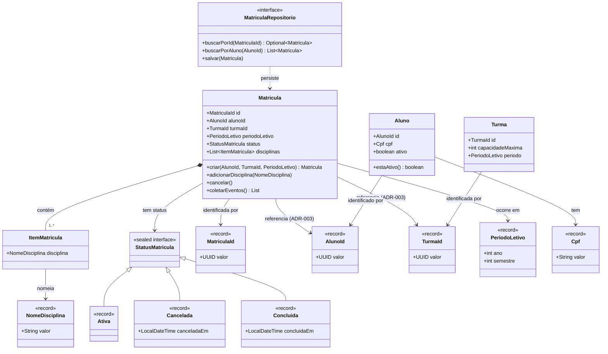
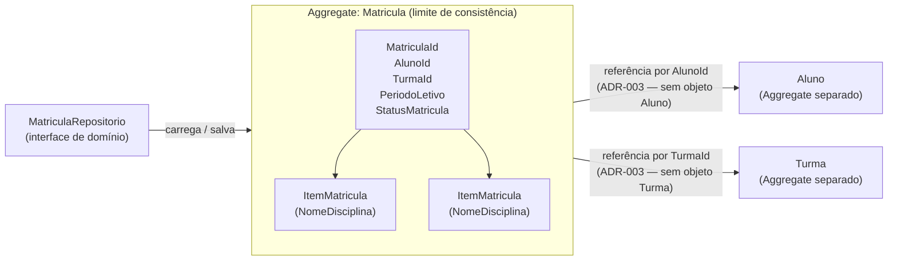
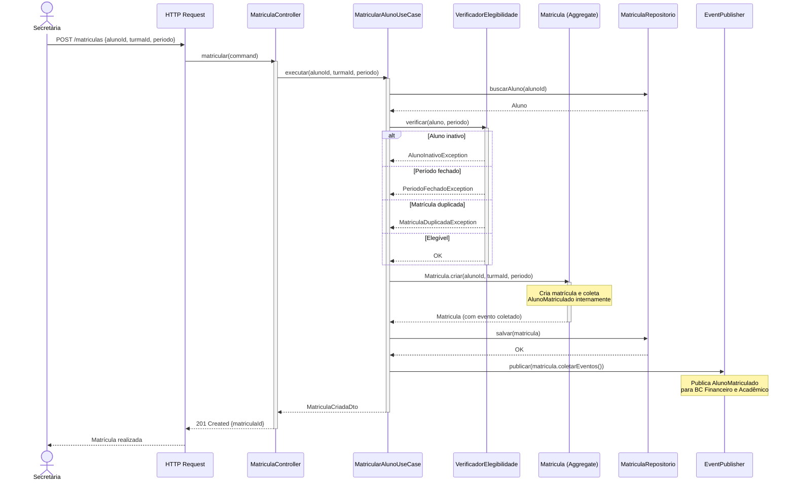

# Phase 2: Design Tatico e Modelagem Visual — Research

**Researched:** 2026-06-20
**Domain:** DDD Tactical Patterns (pedagogical documentation) + Mermaid visual modeling
**Confidence:** HIGH

---

<user_constraints>
## User Constraints (from CONTEXT.md)

### Locked Decisions

- **D-01:** 6 arquivos por padrão DDD em `docs/02-design-tatico/`: `entidades.md`, `value-objects.md`, `agregados.md`, `domain-services.md`, `domain-events.md`, `repositorios.md`.
- **D-02:** Diagramas Mermaid em arquivo dedicado `docs/02-design-tatico/modelagem.md` com os 4 diagramas (MOD-01..04).
- **D-03:** `README.md` da raiz atualizado com nova seção `## Design Tático` com links para os 7 arquivos. Sem README.md local na pasta.
- **D-04:** Abordagem **bottom-up**: cada documento começa com problema concreto do domínio, depois nomeia e define o padrão DDD.
- **D-05:** Cada documento de padrão termina com seção **"Erros Comuns"** — anti-patterns.
- **D-06:** Invariantes do Agregado `Matricula` documentadas com **narrativa + tabela resumo** (inclui argumento de concorrência).
- **D-07:** Snippets **Java 21 prospectivos** — código que SERÁ implementado na Fase 3.
- **D-08:** Features Java 21 **destacadas explicitamente** com comentário de fit DDD.
- **D-09:** Padrão **ERRADO/CERTO** na seção "Erros Comuns": Spring Service (ERRADO) vs DDD (CERTO).
- **D-10:** Sequence diagram de "Realizar Matrícula" com fluxo completo: HTTP → Controller → UseCase → VerificadorElegibilidade → Agregado → Repositório → EventPublisher.
- **D-11:** Flowcharts de negócio com happy path + caminhos de erro (exceções de domínio nomeadas).
- **D-12:** Cada diagrama no `modelagem.md` tem 2-3 linhas de contextualização antes do bloco Mermaid, referenciando ADRs relevantes.

### Claude's Discretion

- Quantidade exata de Value Objects cobertos: todos os mencionados em DOM-01 (Cpf, PeriodoLetivo, MatriculaId, AlunoId, TurmaId, NomeDisciplina) com profundidade proporcional à complexidade de validação.
- Granularidade do diagrama de classes (MOD-01): atributos e métodos relevantes sem poluir o diagrama.
- Se `ItemMatricula` aparece em `entidades.md` ou só em `agregados.md`: decisão por clareza pedagógica.

### Deferred Ideas (OUT OF SCOPE)

Nenhum item deferido — a discussão se manteve dentro do escopo da Fase 2.
</user_constraints>

---

<phase_requirements>
## Phase Requirements

| ID | Description | Research Support |
|----|-------------|------------------|
| TAT-01 | Cada Entidade documentada com identidade, ciclo de vida e responsabilidades | Seção "Entidades no Domínio de Matrícula" abaixo cobre Aluno, Turma, ItemMatricula e padrões de identidade |
| TAT-02 | Cada Value Object documentado explicando motivo, imutabilidade e validação | Seção "Value Objects — Catálogo Completo" cobre os 6 VOs de DOM-01 com regras de validação |
| TAT-03 | Cada Agregado documentado com Aggregate Root, entidades internas e invariantes | Seção "Agregado Matricula — Invariantes e Estrutura" com narrativa + tabela + argumento de concorrência |
| TAT-04 | Domain Services documentados justificando por que a lógica não pertence a uma entidade | Seção "Domain Service vs Application Service" cobre VerificadorElegibilidade com justificativa |
| TAT-05 | Domain Events documentados com evento, gatilho e consumidores | Seção "Domain Events — Catálogo" cobre AlunoMatriculado, DisciplinaAdicionada, MatriculaCancelada |
| TAT-06 | Repositórios documentados como interfaces de domínio | Seção "Repositório como Interface de Domínio" referencia ADR-001 e padrão MyBatis |
| MOD-01 | Diagrama de classes do domínio em Mermaid | Seção "Diagrama de Classes — Elementos e Sintaxe" com modelo completo |
| MOD-02 | Diagrama de agregados em Mermaid | Seção "Diagrama de Agregados — Limites e Composição" |
| MOD-03 | Fluxos de negócio em Mermaid Flowchart (3 fluxos) | Seção "Flowcharts de Negócio — Três Fluxos com Caminhos de Erro" |
| MOD-04 | Sequence diagram do caso de uso "Realizar Matrícula" | Seção "Sequence Diagram — Realizar Matrícula Completo" |
</phase_requirements>

---

## Summary

Esta fase é puramente **documentação pedagógica** — nenhum código Java compilável é entregue. O trabalho consiste em escrever 7 arquivos Markdown que expliquem os 6 padrões táticos DDD usando o domínio de Matrícula como exemplo concreto, produzir 4 diagramas Mermaid que visualizem o modelo, e atualizar o README.md da raiz com a nova seção de navegação.

O conteúdo de domínio necessário já existe na Fase 1: `bounded-contexts.md`, `linguagem-ubiqua.md`, `context-map.md` e os 4 ADRs estabelecem o vocabulário, os limites e as decisões que os documentos táticos devem referenciar. O `contexto-matricula.md` é a fonte primária das regras de negócio. Os snippets Java prospectivos que aparecem nos documentos táticos se tornarão o código real da Fase 3.

A principal atividade de pesquisa nesta fase é: (1) determinar o conteúdo correto de cada documento tático — quais exemplos de domínio, quais anti-patterns, quais comparações ERRADO/CERTO são mais eficazes pedagogicamente; (2) determinar a sintaxe Mermaid correta para os 4 diagramas; (3) mapear as features Java 21 (records, sealed interfaces, pattern matching) para os padrões DDD.

**Recomendação primária:** Sequenciar os 6 documentos táticos na ordem: value-objects → entidades → agregados → domain-services → domain-events → repositorios. Essa ordem reflete dependência conceitual: VOs são simples e concretos (bom ponto de entrada), depois entidades adicionam identidade, depois agregados combinam ambos, depois serviços e eventos constroem sobre o agregado, e repositórios fecham com persistência.

---

## Architectural Responsibility Map

| Capability | Primary Tier | Secondary Tier | Rationale |
|------------|-------------|----------------|-----------|
| Documentação de padrões táticos | Arquivos Markdown em `docs/02-design-tatico/` | — | Fase 2 é 100% documentação; não há camada de código entregue |
| Snippets Java prospectivos | Embedded nos .md files | Fase 3 (implementação real) | Os snippets são especificação técnica, não código executável |
| Diagramas Mermaid | `modelagem.md` | GitHub renderer / qualquer Markdown viewer | Sem ferramenta externa — Mermaid renderiza inline no Markdown |
| Navegação (índice) | `README.md` da raiz | — | D-03: centralizado, sem README local na pasta |

---

## Standard Stack

### Core (this phase)

| Ferramenta | Versão | Propósito | Por que é o padrão |
|------------|--------|-----------|-------------------|
| Mermaid | 11.x (embutido no GitHub/GitLab) | Diagramas inline em Markdown | Sem instalação, renderiza no GitHub — decisão confirmada na Fase 1 [VERIFIED: docs.github.com] |
| Markdown | CommonMark | Documentação | Estabelecido na Fase 1; todo projeto usa |
| Java 21 syntax | LTS | Snippets prospectivos | Stack obrigatório do projeto |

### Bibliotecas Prospectivas (referenciadas nos snippets, implementadas na Fase 3)

| Biblioteca | Versão | Propósito | Status |
|------------|--------|-----------|--------|
| mybatis-spring-boot-starter | 3.0.5 | Persistência (referenciado em repositorios.md) | [VERIFIED: CLAUDE.md — Maven Central consultado 2026-06-20] |
| Spring Boot | 3.5.3 | Framework (referenciado em exemplos de Application Layer) | [VERIFIED: CLAUDE.md — Maven Central consultado 2026-06-20] |

> Esta fase não instala nenhuma dependência. O Standard Stack é de referência para os snippets prospectivos.

---

## Package Legitimacy Audit

> Esta fase não instala pacotes externos. Nenhuma auditoria de legitimidade é necessária.

---

## Architecture Patterns

### System Architecture Diagram — Documentação Tática

```
contexto-matricula.md          linguagem-ubiqua.md
(regras de negócio)            (glossário de termos)
         |                              |
         +----------+   +--------------+
                    |   |
                    v   v
         docs/02-design-tatico/
         ┌─────────────────────────────────────────┐
         │  value-objects.md      entidades.md      │
         │  agregados.md          domain-services.md│
         │  domain-events.md      repositorios.md   │
         │  modelagem.md (4 diagramas Mermaid)      │
         └─────────────────────────────────────────┘
                    |
                    v
         README.md da raiz
         (seção ## Design Tático com links)
                    |
                    v
         docs/02-design-tatico/ serve como
         especificação técnica para Fase 3
         (snippets prospectivos → código real)
```

### Estrutura de Arquivos da Fase

```
docs/
└── 02-design-tatico/
    ├── value-objects.md       # TAT-02 — VOs: Cpf, PeriodoLetivo, MatriculaId, AlunoId, TurmaId, NomeDisciplina
    ├── entidades.md           # TAT-01 — Entidades: Aluno, Turma, ItemMatricula (possivelmente)
    ├── agregados.md           # TAT-03 — Aggregate Root Matricula com invariantes
    ├── domain-services.md     # TAT-04 — VerificadorElegibilidadeMatricula
    ├── domain-events.md       # TAT-05 — AlunoMatriculado, DisciplinaAdicionada, MatriculaCancelada
    ├── repositorios.md        # TAT-06 — Interface MatriculaRepositorio
    └── modelagem.md           # MOD-01..04 — 4 diagramas Mermaid

README.md (raiz)               # D-03 — nova seção ## Design Tático com links
```

### Sequenciamento de Leitura dos Documentos (D-04 — bottom-up)

A ordem recomendada de escrita e leitura segue dependência conceitual crescente:

1. **value-objects.md** — ponto de entrada mais simples: sem identidade, imutável, comparado por valor. `Cpf`, `PeriodoLetivo` são concretos e intuitivos. [ASSUMED — baseado em princípio pedagógico amplamente reconhecido em literatura DDD]
2. **entidades.md** — adiciona identidade. Contrasta com VO: "por que `Aluno` não é um record?"
3. **agregados.md** — combina entidades + VOs em unidade de consistência. O mais complexo — cobre invariantes de `Matricula`.
4. **domain-services.md** — lógica que não pertence a nenhuma entidade. Curto: só `VerificadorElegibilidade`.
5. **domain-events.md** — o que acontece depois que o agregado muda. Liga ao Context Map da Fase 1.
6. **repositorios.md** — interface de persistência no domínio. Fecha o círculo com ADR-001.

### Anti-Patterns a Evitar na Escrita dos Documentos

- **Top-down**: não começar com "Em DDD, uma Entidade é..." — começar com o problema de domínio concreto que o padrão resolve
- **Definições sem exemplos do domínio**: nunca usar exemplo genérico (`Animal`, `Person`) quando existe `Aluno`, `Matricula`, `Cpf` disponíveis
- **Snippets sem comentários de fit DDD**: cada feature Java 21 usada deve ter comentário explicando por que o padrão DDD se beneficia dela
- **ERRADO sem reconhecimento**: o snippet ERRADO deve usar código que o desenvolvedor target realmente escreve hoje (Spring Service com `@Service`, `@Autowired`, lógica no service)

---

## Conteúdo dos Documentos Táticos

### TAT-01: entidades.md — Entidades do Domínio

**Entidades a cobrir:**

| Entidade | Identidade | Ciclo de Vida | Responsabilidades |
|----------|-----------|---------------|------------------|
| `Aluno` | `AlunoId` (record UUID) | Ativo / Inativo (status pode mudar) | Ser elegível para matrícula; carrega status |
| `Turma` | `TurmaId` (record UUID) | Oferta em um período; pode esgotar vagas | Capacidade máxima de vagas; período letivo |
| `ItemMatricula` | Sem ID próprio — parte do Aggregate | Criado com a disciplina; sem ciclo de vida independente | Representa uma disciplina incluída na matrícula |

**Decisão sobre `ItemMatricula`:** Tratar em `agregados.md` dentro da explicação do Aggregate `Matricula`, não em `entidades.md`. Razão pedagógica: `ItemMatricula` sem `Matricula` não tem significado — ele pertence ao contexto do Aggregate, não ao catálogo de Entidades independentes. [ASSUMED — baseado em clareza pedagógica]

**Comparação central de entidades.md:**

```
// ERRADO — comparação por conteúdo (como um VO)
aluno1.equals(aluno2) → compara nome, cpf, endereço...

// CERTO — comparação por identidade
aluno1.equals(aluno2) → compara apenas AlunoId
```

**Java 21 fit em entidades.md:**
- `AlunoId` é um `record` com `UUID valor` — VO tipado para identidade (sem confusão entre AlunoId e TurmaId)
- A entidade `Aluno` NÃO é um record porque tem mutabilidade de estado (status ativo/inativo pode mudar)
- Contraste explícito: "record = imutável = VO; classe = mutável = Entidade"

**Snippet prospectivo para `Aluno`:**

```java
// Java 21: identidade tipada como record (Value Object)
// AlunoId não é UUID cru — o compilador distingue AlunoId de TurmaId
public record AlunoId(UUID valor) {
    public AlunoId {
        Objects.requireNonNull(valor, "AlunoId não pode ser nulo");
    }
}

// Entidade: identidade estável, estado mutável
public class Aluno {
    private final AlunoId id;   // identidade imutável
    private boolean ativo;      // estado que pode mudar

    public Aluno(AlunoId id, boolean ativo) {
        this.id = Objects.requireNonNull(id);
        this.ativo = ativo;
    }

    public boolean estaAtivo() { return ativo; }

    // equals/hashCode por identidade — nunca por atributos
    @Override
    public boolean equals(Object o) {
        if (this == o) return true;
        if (!(o instanceof Aluno a)) return false;
        return id.equals(a.id);
    }

    @Override
    public int hashCode() { return id.hashCode(); }
}
```

---

### TAT-02: value-objects.md — Value Objects do Domínio

**Catálogo completo dos VOs (DOM-01):**

| VO | Tipo Java 21 | Validação no Construtor Compacto | Complexidade |
|----|-------------|----------------------------------|-------------|
| `Cpf` | `record Cpf(String valor)` | Remove máscara, verifica 11 dígitos numéricos, algoritmo de dígito verificador | ALTA — lógica de validação real |
| `PeriodoLetivo` | `record PeriodoLetivo(int ano, int semestre)` | `ano >= 2000`, `semestre >= 1 && semestre <= 2` | BAIXA — regras simples |
| `MatriculaId` | `record MatriculaId(UUID valor)` | `Objects.requireNonNull(valor)` | MÍNIMA — só null-check |
| `AlunoId` | `record AlunoId(UUID valor)` | `Objects.requireNonNull(valor)` | MÍNIMA — só null-check |
| `TurmaId` | `record TurmaId(UUID valor)` | `Objects.requireNonNull(valor)` | MÍNIMA — só null-check |
| `NomeDisciplina` | `record NomeDisciplina(String valor)` | `valor != null && !valor.isBlank() && valor.length() <= 100` | BAIXA — regras simples |

**Decisão de profundidade (Claude's Discretion):** `Cpf` recebe cobertura completa com exemplo do algoritmo de dígito verificador — é o VO mais pedagogicamente rico (validação real de negócio). Os IDs tipados (`MatriculaId`, `AlunoId`, `TurmaId`) são agrupados: eles demonstram o mesmo padrão de ID tipado (mencionado em ADR-003) e não precisam de seção individual. `PeriodoLetivo` e `NomeDisciplina` merecem seção própria por terem regras de negócio distintas.

**Java 21 fit em value-objects.md:**

```java
// Java 21: construtor compacto = validação sem boilerplate
// record garante imutabilidade em tempo de compilação — sem setter possível
public record Cpf(String valor) {
    public Cpf {  // construtor compacto — sem parâmetros explícitos
        Objects.requireNonNull(valor, "CPF não pode ser nulo");
        String apenasDigitos = valor.replaceAll("[^0-9]", "");
        if (apenasDigitos.length() != 11) {
            throw new IllegalArgumentException("CPF deve ter 11 dígitos: " + valor);
        }
        // validação do dígito verificador...
    }
}

// Comparação por valor — dois records com mesmo CPF são iguais
// (Java 21 records geram equals/hashCode automaticamente por todos os campos)
Cpf cpf1 = new Cpf("123.456.789-09");
Cpf cpf2 = new Cpf("123.456.789-09");
cpf1.equals(cpf2); // true — sem @Override necessário
```

**ERRADO/CERTO para value-objects.md:**

```java
// ERRADO — String crua vaza validação para quem chama
@Service
public class MatriculaService {
    public void matricular(String cpfAluno, String periodo) {
        if (cpfAluno == null || cpfAluno.length() != 11) { // validação espalhada
            throw new RuntimeException("CPF inválido");
        }
        // periodo pode ser "2026-3" — inválido, mas compilou
    }
}

// CERTO — validação concentrada no VO, impossível criar CPF inválido
public class MatricularAlunoUseCase {
    public void executar(Cpf cpf, PeriodoLetivo periodo) {
        // se chegou aqui, Cpf e PeriodoLetivo já são válidos
        // é impossível passar Cpf inválido — o construtor do record rejeitaria
    }
}
```

---

### TAT-03: agregados.md — Aggregate Matricula

**Estrutura do Aggregate `Matricula`:**

```
Aggregate Root: Matricula
├── MatriculaId (VO — identidade)
├── AlunoId (VO — referência por ID, ADR-003)
├── TurmaId (VO — referência por ID, ADR-003)
├── PeriodoLetivo (VO — parte do Aggregate)
├── StatusMatricula (sealed interface)
├── List<ItemMatricula> (entidade interna)
└── List<DomainEvent> (eventos coletados)
```

**Invariantes — narrativa + tabela:**

| Invariante | Regra | Exceção Lançada |
|-----------|-------|-----------------|
| Limite de disciplinas | Máximo 6 disciplinas por matrícula | `LimiteDisciplinasExcedidoException` |
| Sem duplicidade | A mesma disciplina não pode aparecer duas vezes | `DisciplinaJaMatriculadaException` |
| Estado terminal | Matrícula cancelada não recebe disciplinas | `MatriculaCanceladaException` |

**O argumento de concorrência (D-06):** Este argumento é central e deve aparecer no documento:
> "Se a verificação do limite de 6 disciplinas estivesse no Service, duas threads concorrentes poderiam cada uma consultar a matrícula, encontrar 5 disciplinas, e adicionar mais uma — resultando em 7 disciplinas no banco. O Aggregate protege a invariante porque a verificação e a modificação acontecem dentro da mesma transação, no mesmo objeto carregado em memória. A consistência é garantida pela transação + pelo Aggregate, não pela boa vontade de quem chama o Service."

**StatusMatricula com sealed interface (feature D-08/D-09):**

```java
// Java 21: sealed interface = estados finitos garantidos em compilação
// O compilador EXIGE que todos os casos sejam tratados no switch
public sealed interface StatusMatricula
    permits StatusMatricula.Ativa, StatusMatricula.Cancelada, StatusMatricula.Concluida {

    record Ativa() implements StatusMatricula {}
    record Cancelada(LocalDateTime canceladaEm) implements StatusMatricula {}
    record Concluida(LocalDateTime concluidaEm) implements StatusMatricula {}
}

// Pattern matching com switch exaustivo — sem default
public boolean podeAdicionarDisciplina() {
    return switch (this.status) {
        case StatusMatricula.Ativa a -> true;
        case StatusMatricula.Cancelada c -> false;  // compilador garante que
        case StatusMatricula.Concluida c -> false;  // todos os casos são cobertos
        // sem default: se novo estado for adicionado, compilador avisa
    };
}
```

**adicionarDisciplina() — método completo do Aggregate Root:**

```java
public void adicionarDisciplina(NomeDisciplina disciplina) {
    // Invariante 1: estado
    if (!(this.status instanceof StatusMatricula.Ativa)) {
        throw new MatriculaCanceladaException(this.id);
    }
    // Invariante 2: duplicidade
    boolean jaMatriculada = this.disciplinas.stream()
        .anyMatch(item -> item.disciplina().equals(disciplina));
    if (jaMatriculada) {
        throw new DisciplinaJaMatriculadaException(disciplina, this.id);
    }
    // Invariante 3: limite
    if (this.disciplinas.size() >= LIMITE_DISCIPLINAS) {
        throw new LimiteDisciplinasExcedidoException(LIMITE_DISCIPLINAS, this.id);
    }
    this.disciplinas.add(new ItemMatricula(disciplina));
    this.eventos.add(new DisciplinaAdicionada(this.id, disciplina, LocalDateTime.now()));
}
```

**ERRADO/CERTO para agregados.md:**

```java
// ERRADO — invariante no Service (vulnerável a concorrência, espalhada)
@Service
public class MatriculaService {
    public void adicionarDisciplina(UUID matriculaId, String disciplina) {
        Matricula matricula = repo.buscarPorId(new MatriculaId(matriculaId));
        if (matricula.getDisciplinas().size() >= 6) { // lógica fora do agregado
            throw new RuntimeException("Limite atingido");
        }
        matricula.getDisciplinas().add(new ItemMatricula(disciplina)); // acesso direto
        repo.salvar(matricula);
    }
}

// CERTO — invariante encapsulada no Aggregate Root
public class AdicionarDisciplinaUseCase {
    public void executar(MatriculaId id, NomeDisciplina disciplina) {
        Matricula matricula = repositorio.buscarPorId(id)
            .orElseThrow(() -> new MatriculaNaoEncontradaException(id));
        matricula.adicionarDisciplina(disciplina); // Aggregate decide, lança exceção se inválido
        repositorio.salvar(matricula);
        publicar(matricula.coletarEventos());
    }
}
```

---

### TAT-04: domain-services.md — Domain Services

**O único Domain Service do escopo:** `VerificadorElegibilidadeMatricula`

**Justificativa de por que não pertence a uma entidade:**
- Verifica `Aluno` (está ativo?) + `PeriodoLetivo` (está aberto?) + `MatriculaRepositorio` (existe matrícula duplicada?)
- Nenhuma Entidade sozinha tem acesso a todos esses dados — é uma operação que cruza múltiplas entidades
- Regra de negócio com nome reconhecível pela Secretaria: "verificar elegibilidade de matrícula" é um verbo do domínio, não um detalhe técnico

**Responsabilidades de VerificadorElegibilidade:**

```java
// Domain Service: regra que não pertence a uma Entidade específica
public class VerificadorElegibilidadeMatricula {

    private final MatriculaRepositorio repositorio;

    public void verificar(Aluno aluno, PeriodoLetivo periodo) {
        if (!aluno.estaAtivo()) {
            throw new AlunoInativoException(aluno.getId());
        }
        if (!periodo.estaAberto()) {
            throw new PeriodoFechadoException(periodo);
        }
        boolean matriculaExistente = repositorio.existeMatriculaAtiva(aluno.getId(), periodo);
        if (matriculaExistente) {
            throw new MatriculaDuplicadaException(aluno.getId(), periodo);
        }
    }
}
```

**Distinção Domain Service vs Application Service (critical pedagogy):**

| Aspecto | Domain Service | Application Service (UseCase) |
|---------|---------------|-------------------------------|
| Onde vive | `dominio/` — sem import de framework | `aplicacao/` — pode usar Spring |
| O que faz | Regra de negócio pura que cruza entidades | Orquestra: busca, chama domínio, salva, publica eventos |
| Exemplo | `VerificadorElegibilidade.verificar()` | `MatricularAlunoUseCase.executar()` |
| Dependências | Só interfaces de domínio | Usa repositório, event publisher, outros serviços |
| Transação | Não gerencia transação | Pode demarcar `@Transactional` |

**ERRADO/CERTO para domain-services.md:**

```java
// ERRADO — lógica de negócio no Application Service (confunde as responsabilidades)
@Service
public class MatricularAlunoUseCase {
    public void executar(UUID alunoId, String periodo) {
        Aluno aluno = alunoRepo.findById(alunoId).orElseThrow();
        if (!aluno.isAtivo()) throw new RuntimeException("Aluno inativo"); // regra de negócio aqui?
        if (matriculaRepo.existsByAlunoAndPeriodo(alunoId, periodo)) throw new RuntimeException("Duplicada");
        // ... cria matrícula
    }
}

// CERTO — Application Service delega regra de negócio ao Domain Service
public class MatricularAlunoUseCase {
    private final VerificadorElegibilidadeMatricula verificador;

    public void executar(AlunoId alunoId, PeriodoLetivo periodo) {
        Aluno aluno = alunoRepositorio.buscarPorId(alunoId).orElseThrow();
        verificador.verificar(aluno, periodo); // Domain Service cuida da regra
        Matricula matricula = Matricula.criar(alunoId, turmaId, periodo);
        matriculaRepositorio.salvar(matricula);
        publicar(matricula.coletarEventos());
    }
}
```

---

### TAT-05: domain-events.md — Domain Events

**Catálogo de eventos (do context-map.md):**

| Evento | Publicado Por | Consumido Por | Gatilho | Campos |
|--------|--------------|---------------|---------|--------|
| `AlunoMatriculado` | BC Matrícula | BC Financeiro, BC Acadêmico | `Matricula.criar()` | `matriculaId`, `alunoId`, `turmaId`, `periodoLetivo`, `ocorridoEm` |
| `DisciplinaAdicionada` | BC Matrícula | BC Acadêmico | `Matricula.adicionarDisciplina()` | `matriculaId`, `alunoId`, `disciplina`, `ocorridoEm` |
| `MatriculaCancelada` | BC Matrícula | BC Financeiro, BC Acadêmico | `Matricula.cancelar()` | `matriculaId`, `alunoId`, `periodoLetivo`, `ocorridoEm` |

**Java 21 fit em domain-events.md:**

```java
// Java 21: record = imutabilidade por padrão = ideal para eventos (nunca se modificam)
// Evento é um fato histórico — o passado não muda
public record AlunoMatriculado(
    MatriculaId matriculaId,
    AlunoId alunoId,
    TurmaId turmaId,
    PeriodoLetivo periodoLetivo,
    LocalDateTime ocorridoEm  // quando aconteceu, não quando foi processado
) {}
```

**Mecanismo de coleta de eventos no Aggregate (DOM-07):**

```java
// Aggregate coleta eventos internamente — sem dependência do Spring
public class Matricula {
    private final List<Object> eventos = new ArrayList<>();

    // Chamado pelo UseCase após salvar
    public List<Object> coletarEventos() {
        List<Object> copia = List.copyOf(this.eventos);
        this.eventos.clear();
        return copia;
    }
}
```

**Por que Domain Events cruzam fronteiras (link com context-map.md):**
Referência explícita: o `context-map.md` da Fase 1 mostra o diagrama e os padrões OHS/PL. O documento `domain-events.md` deve referenciar isso: "O Context Map documenta que BC Matrícula é Upstream (Supplier) — ele publica os eventos; Financeiro e Acadêmico são Downstream (Customers) — eles consomem."

---

### TAT-06: repositorios.md — Repositório como Interface de Domínio

**Interface no domínio — sem nenhum import de framework:**

```java
// dominio/ — zero imports de framework
// A interface existe no domínio; a implementação existe na infraestrutura
public interface MatriculaRepositorio {
    Optional<Matricula> buscarPorId(MatriculaId id);
    List<Matricula> buscarPorAluno(AlunoId alunoId);
    boolean existeMatriculaAtiva(AlunoId alunoId, PeriodoLetivo periodo);
    void salvar(Matricula matricula);
}
```

**Implementação na infraestrutura (referenciada, não implementada na Fase 2):**

```java
// infraestrutura/ — aqui entra o MyBatis
// O domínio não sabe que isso existe
@Repository // única anotação Spring — e está na infraestrutura, não no domínio
public class MatriculaRepositorioMyBatis implements MatriculaRepositorio {
    // implementação com MyBatis Mapper
}
```

**Ponto pedagógico central (link com ADR-001):**
"O domínio define o contrato (`MatriculaRepositorio`); a infraestrutura cumpre o contrato (`MatriculaRepositorioMyBatis`). Isso é a Regra de Dependência em ação: o domínio não depende da infraestrutura; a infraestrutura depende do domínio."

**ERRADO/CERTO para repositorios.md:**

```java
// ERRADO — Spring Data JPA: o domínio herda de JpaRepository (dependência de framework)
public interface MatriculaRepository extends JpaRepository<Matricula, UUID> {
    // JpaRepository está em jakarta.persistence — o domínio importa framework
    List<Matricula> findByAlunoId(UUID alunoId);
}

// CERTO — Interface pura no domínio, sem herança de framework
public interface MatriculaRepositorio {
    Optional<Matricula> buscarPorId(MatriculaId id);
    List<Matricula> buscarPorAluno(AlunoId alunoId);
    void salvar(Matricula matricula);
    // zero imports de framework — o domínio define o contrato em seus próprios termos
}
```

---

## Diagramas Mermaid — Especificação Completa

### MOD-01: Diagrama de Classes

**Sintaxe Mermaid confirmada:** `classDiagram` com membros definidos em bloco `{}`. Visibilidade: `+` público, `-` privado. Relações: `*--` (composição), `-->` (associação), `<|--` (herança/implementação). [VERIFIED: mermaid.js.org/syntax/classDiagram.html]

**Modelo completo para o diagrama:**



**Notas de granularidade (Claude's Discretion):** O diagrama acima inclui atributos mas limita métodos ao essencial (só os operacionais do Aggregate Root e da interface do Repositório). Eventos de domínio aparecem na seção de `domain-events.md` e no sequence diagram — não no diagrama de classes para evitar poluição.

---

### MOD-02: Diagrama de Agregados

**Objetivo:** Mostrar os limites do Aggregate — o que está dentro (controlado pelo Aggregate Root), o que é referência por ID (ADR-003), e o que está fora.

**Sintaxe:** `flowchart LR` ou `TD` com `subgraph` para delimitar o Aggregate. [VERIFIED: mermaid.js.org/syntax/flowchart.html]



---

### MOD-03: Flowcharts de Negócio (3 fluxos)

**Sintaxe confirmada:** `flowchart TD`, nós de decisão `{texto}`, happy path e ramos de erro com labels nas arestas `-->|condição|`. [VERIFIED: mermaid.js.org/syntax/flowchart.html]

**Fluxo 1: Realizar Matrícula**

```mermaid
flowchart TD
    START([Secretaria inicia matrícula]) --> VER_ALUNO{Aluno está ativo?}
    VER_ALUNO -->|Não| ERR1[AlunoInativoException]
    VER_ALUNO -->|Sim| VER_PERIODO{Período letivo aberto?}
    VER_PERIODO -->|Não| ERR2[PeriodoFechadoException]
    VER_PERIODO -->|Sim| VER_DUP{Matrícula duplicada no período?}
    VER_DUP -->|Sim| ERR3[MatriculaDuplicadaException]
    VER_DUP -->|Não| CRIA[Matricula.criar()]
    CRIA --> SALVA[MatriculaRepositorio.salvar()]
    SALVA --> EVENTO[Publica AlunoMatriculado]
    EVENTO --> FIN([Matrícula realizada])
    ERR1 --> FAIL([Falha — 422])
    ERR2 --> FAIL
    ERR3 --> FAIL
```

**Fluxo 2: Adicionar Disciplina**

```mermaid
flowchart TD
    START([Aluno adiciona disciplina]) --> BUSCA[Busca Matricula por id]
    BUSCA --> VER_CANCEL{Matrícula cancelada?}
    VER_CANCEL -->|Sim| ERR1[MatriculaCanceladaException]
    VER_CANCEL -->|Não| VER_DUP{Disciplina já incluída?}
    VER_DUP -->|Sim| ERR2[DisciplinaJaMatriculadaException]
    VER_DUP -->|Não| VER_LIMITE{Atingiu limite de disciplinas?}
    VER_LIMITE -->|Sim| ERR3[LimiteDisciplinasExcedidoException]
    VER_LIMITE -->|Não| ADD[Matricula.adicionarDisciplina()]
    ADD --> SALVA[MatriculaRepositorio.salvar()]
    SALVA --> EVENTO[Publica DisciplinaAdicionada]
    EVENTO --> FIN([Disciplina adicionada])
    ERR1 --> FAIL([Falha — 422])
    ERR2 --> FAIL
    ERR3 --> FAIL
```

**Fluxo 3: Cancelar Matrícula**

```mermaid
flowchart TD
    START([Secretaria cancela matrícula]) --> BUSCA[Busca Matricula por id]
    BUSCA --> VER_EXISTS{Matrícula existe?}
    VER_EXISTS -->|Não| ERR1[MatriculaNaoEncontradaException]
    VER_EXISTS -->|Sim| VER_CANCEL{Já está cancelada?}
    VER_CANCEL -->|Sim| ERR2[MatriculaJaCanceladaException]
    VER_CANCEL -->|Não| CANCEL[Matricula.cancelar()]
    CANCEL --> SALVA[MatriculaRepositorio.salvar()]
    SALVA --> EVENTO[Publica MatriculaCancelada]
    EVENTO --> FIN([Matrícula cancelada])
    ERR1 --> FAIL([Falha — 404 / 422])
    ERR2 --> FAIL
```

---

### MOD-04: Sequence Diagram — Realizar Matrícula

**Sintaxe confirmada:** `sequenceDiagram`, `participant`, `->>` (síncronos), `-->>` (retornos assíncronos), `activate`/`deactivate`, `alt`/`else` para caminhos de erro, `Note`. [VERIFIED: mermaid.js.org/syntax/sequenceDiagram.html]

**Fluxo completo (D-10):**



---

## Don't Hand-Roll

| Problema | Não Construir | Usar em Vez | Por quê |
|----------|--------------|-------------|---------|
| Validação de CPF | Algoritmo manual duplicado em múltiplos lugares | Construtor compacto do record `Cpf` — uma única implementação | DRY: um só lugar de validação, impossível criar CPF inválido |
| Comparação de identidade de Entidade | Override manual espalhado ou ausente | `equals`/`hashCode` por ID tipado (padrão estabelecido) | Evita bugs de comparação por conteúdo |
| IDs primitivos (UUID cru) | `UUID alunoId` que pode ser confundido com `UUID turmaId` | `record AlunoId(UUID valor)` — distinção em compilação | ADR-003: referência por ID tipado |
| Estados com `String` ou `enum` simples | `if (status.equals("ATIVA"))` em vários lugares | `sealed interface StatusMatricula` com pattern matching | Exaustividade garantida pelo compilador |
| Coleta de eventos com dependência de framework | `applicationEventPublisher.publishEvent()` dentro do Aggregate | Coleta interna (`List<Object> eventos`) sem import de Spring | DOM-07: Aggregate sem dependência de framework |

**Insight central:** Os padrões táticos DDD são a solução para problemas que, em arquitetura tradicional, são resolvidos com lógica espalhada nos Services. A documentação pedagógica deve fazer essa conexão explícita em cada ERRADO/CERTO.

---

## Common Pitfalls

### Pitfall 1: Começar o documento com definição DDD (top-down)
**O que dá errado:** Desenvolvedor lê "Em DDD, uma Entidade é um objeto com identidade..." e não conecta ao seu contexto concreto. Abandona a leitura como teoria abstrata.
**Por que acontece:** É a forma como livros DDD tradicionais apresentam os padrões (Evans, Vernon).
**Como evitar:** D-04 — bottom-up obrigatório: começar com "O que aconteceria se CPF fosse uma String?" antes de nomear o padrão Value Object.
**Sinais de alerta:** Qualquer documento que começa com "Em DDD, ..." deve ser reescrito.

### Pitfall 2: Mermaid classDiagram com nomes de campos com caracteres especiais
**O que dá errado:** `List<ItemMatricula>` em atributos quebra o parser Mermaid.
**Por que acontece:** Mermaid usa `<>` para outros propósitos em classDiagram.
**Como evitar:** Usar `List~ItemMatricula~` (til ao invés de ângulo). [VERIFIED: mermaid.js.org]
**Sinais de alerta:** Diagrama não renderiza; GitHub mostra bloco de código em vez de diagrama.

### Pitfall 3: Sequence diagram com palavra "end" em nome de participante
**O que dá errado:** Participante chamado `end` ou texto contendo "end" isolado quebra o parser.
**Por que acontece:** "end" é palavra reservada do Mermaid para fechar blocos `alt`/`loop`.
**Como evitar:** Usar aspas ou alias: `participant FIN as "Fim do Fluxo"`. [VERIFIED: mermaid.js.org]
**Sinais de alerta:** Diagrama truncado ou sem renderização após o ponto que contém "end".

### Pitfall 4: Tratar `ItemMatricula` como Entidade independente
**O que dá errado:** Se documentado em `entidades.md` como Entidade independente, cria confusão — aluno tenta criar `ItemMatricula` sem `Matricula`.
**Por que acontece:** `ItemMatricula` parece uma "entidade" por ter campos e comportamento.
**Como evitar:** Documentar em `agregados.md` como entidade interna do Aggregate. Deixar explícito: "sem `Matricula`, `ItemMatricula` não faz sentido — não existe fora do Aggregate".

### Pitfall 5: Snippets ERRADO sem comentário de reconhecimento
**O que dá errado:** Desenvolvedor vê o ERRADO e pensa "eu nunca faria assim" — não se identifica, não aprende.
**Por que acontece:** O snippet ERRADO é escrito de forma caricata, óbvia demais.
**Como evitar:** O ERRADO deve parecer código razoável de Spring Boot real — com `@Service`, `@Autowired`, nomes em inglês se o projeto original era em inglês. O problema deve ser sutil, não óbvio. D-09 é claro: "código estilo Spring Service típico que o desenvolvedor conhece".

### Pitfall 6: Flowchart sem labels nas arestas de decisão
**O que dá errado:** Diagrama de fluxo com diamante `{}` sem labels mostra dois caminhos sem indicar qual é qual.
**Por que acontece:** Labels em arestas são opcionais no Mermaid — fácil esquecer.
**Como evitar:** Toda aresta saindo de nó de decisão `{...}` deve ter label: `-->|Sim|` e `-->|Não|`. [VERIFIED: mermaid.js.org]

---

## Code Examples

Padrões verificados e confirmados como corretos para os documentos táticos.

### Java 21 Record como Value Object (value-objects.md)

```java
// Source: JEP 395 (Records — Java 16+, finalizados); Java 21 LTS [VERIFIED: JDK docs]
public record PeriodoLetivo(int ano, int semestre) {
    public PeriodoLetivo {  // construtor compacto
        if (ano < 2000) throw new IllegalArgumentException("Ano inválido: " + ano);
        if (semestre < 1 || semestre > 2) throw new IllegalArgumentException("Semestre inválido: " + semestre);
    }
    // equals, hashCode, toString gerados automaticamente pelo compilador
    // sem setter possível — imutabilidade garantida pela linguagem
}
```

### Java 21 Sealed Interface como Estado (agregados.md)

```java
// Source: JEP 409 (Sealed Classes — Java 17+); Pattern Matching for switch — JEP 441 (Java 21) [VERIFIED: JDK docs]
public sealed interface StatusMatricula
    permits StatusMatricula.Ativa, StatusMatricula.Cancelada, StatusMatricula.Concluida {
    record Ativa() implements StatusMatricula {}
    record Cancelada(LocalDateTime canceladaEm) implements StatusMatricula {}
    record Concluida(LocalDateTime concluidaEm) implements StatusMatricula {}
}
// Pattern matching exaustivo — sem default necessário
String descricao = switch (status) {
    case StatusMatricula.Ativa a -> "Em andamento";
    case StatusMatricula.Cancelada c -> "Cancelada em " + c.canceladaEm();
    case StatusMatricula.Concluida c -> "Concluída em " + c.concluidaEm();
};
```

### Mermaid classDiagram — Atributo genérico

```
// Source: mermaid.js.org/syntax/classDiagram.html [VERIFIED]
// Use ~ em vez de <> para tipos genéricos
class Matricula {
    +List~ItemMatricula~ disciplinas   // correto
    // +List<ItemMatricula> disciplinas  // QUEBRA o parser
}
```

### Mermaid sequenceDiagram — alt/else para caminhos de erro

```
// Source: mermaid.js.org/syntax/sequenceDiagram.html [VERIFIED]
sequenceDiagram
    A->>B: requisição
    alt Caso de erro 1
        B-->>A: Exceção 1
    else Caso de erro 2
        B-->>A: Exceção 2
    else Sucesso
        B-->>A: Resultado
    end
```

---

## State of the Art

| Abordagem Antiga | Abordagem Atual | Quando Mudou | Impacto para este Projeto |
|-----------------|-----------------|--------------|---------------------------|
| `enum` simples para estados | `sealed interface` + records | Java 17+ (finalizado Java 21) | StatusMatricula usa sealed interface para exaustividade em compilação |
| Classes POJO com Lombok para VOs | `record` Java 21 | Java 16+ (finalizado), comum desde Java 17 | Todos os VOs são records — sem Lombok, sem boilerplate |
| `default` obrigatório em switch | Pattern matching para switch exaustivo | Java 21 (JEP 441, final) | switch em StatusMatricula sem default — compilador garante cobertura |
| Mermaid v9 syntax | Mermaid v10/v11 com namespace e novas formas | 2023-2024 | Namespace em classDiagram disponível mas não necessário para este projeto |

**Deprecated/Outdated:**
- `@Entity` no domínio: JPA coloca persistência no modelo de domínio — o ADR-001 rejeita explicitamente
- `extends JpaRepository`: cria dependência de framework no domínio — contradiz TAT-06
- `String` como tipo de ID: substituído por IDs tipados (`AlunoId`, `TurmaId`) — ADR-003

---

## Assumptions Log

| # | Claim | Section | Risk if Wrong |
|---|-------|---------|---------------|
| A1 | Sequenciar documentos na ordem value-objects → entidades → agregados → domain-services → domain-events → repositorios é pedagogicamente ótimo | Architecture Patterns | Ordem alternativa (ex: agregados primeiro) pode ser igualmente válida — baixo risco, pode ser ajustada pelo usuário |
| A2 | `ItemMatricula` deve ser documentado em `agregados.md`, não em `entidades.md` | TAT-01 / Claude's Discretion | Se o usuário quiser cobertura em entidades.md também, o conteúdo precisaria ser duplicado ou referenciado |
| A3 | Limite de 6 disciplinas por matrícula (usado nos exemplos de invariante) | TAT-03 | O contexto-matricula.md menciona "limite de N disciplinas" sem número fixo — 6 é razoável para exemplos, mas o número real pode ser configurável |

**Nota sobre A3:** O `contexto-matricula.md` e `bounded-contexts.md` mencionam "limite de disciplinas" sem fixar o número. Nos snippets e exemplos, usar 6 como constante nomeada (`private static final int LIMITE_DISCIPLINAS = 6;`) para deixar claro que é configurável. Não apresentar como regra de negócio fixa.

---

## Open Questions

1. **Número fixo do limite de disciplinas**
   - O que sabemos: `bounded-contexts.md` menciona "limite de N disciplinas" sem valor fixo
   - O que está incerto: se 6 é o número correto ou se deve ser configurável
   - Recomendação: usar constante nomeada `LIMITE_DISCIPLINAS = 6` nos snippets, com nota "(valor configurável — definido pela instituição)"

2. **`Turma` como Aggregate**
   - O que sabemos: `bounded-contexts.md` cita "a turma possui vagas disponíveis" como regra do BC Matrícula, mas o STATE.md nota "granularidade do Aggregate Matrícula vs. Turma: ignorar vagas no v1"
   - O que está incerto: `Turma` é uma Entidade independente ou faz parte do Aggregate `Matricula`?
   - Recomendação: Documentar `Turma` como Entidade independente em `entidades.md`, sem Aggregate próprio no v1. A `Matricula` referencia `TurmaId` (não `Turma`) conforme ADR-003. A regra de vagas é mencionada como "verificada fora do escopo do v1" com nota sobre futura implementação.

---

## Environment Availability

> Fase 2 é 100% criação de arquivos Markdown. Nenhuma dependência de ambiente externo é necessária.

**Step 2.6: SKIPPED** — Esta fase produz apenas arquivos `.md` e nenhuma ferramenta externa, serviço, CLI ou banco de dados é necessário para executá-la. Nenhuma verificação de disponibilidade de ambiente é necessária.

---

## Validation Architecture

> `workflow.nyquist_validation` está explicitamente `false` em `.planning/config.json`. Esta seção é omitida.

---

## Security Domain

> Esta fase entrega apenas documentação Markdown. Não há código executável, endpoints, dados de usuário ou operações de segurança. Seção de segurança omitida — não aplicável.

---

## Project Constraints (from CLAUDE.md)

Diretivas obrigatórias extraídas de `CLAUDE.md` — o planner deve verificar conformidade:

| Diretiva | Impacto na Fase 2 |
|----------|--------------------|
| Java 21, Spring Boot 3.x, MyBatis, PostgreSQL — stack não negociável | Todos os snippets Java prospectivos devem usar Java 21 (records, sealed, pattern matching). Nenhum snippet com JPA, Lombok, MapStruct. |
| MyBatis (não JPA) — decisão pedagógica central | `repositorios.md` deve mostrar interface de domínio pura + referência à implementação MyBatis na infraestrutura. Snippet ERRADO deve mostrar `extends JpaRepository`. |
| Diagramas em Mermaid (sem ferramentas externas) | Todos os 4 diagramas em blocos ` ```mermaid ``` ` dentro de `modelagem.md`. Sem PlantUML, Draw.io, ou imagens. |
| Documentação em Markdown, em português | Todos os 7 arquivos em `.md` com texto em português. Nomes de classes/métodos nos snippets em português (ADR-004). |
| Bounded Context implementado: apenas Matrícula | Snippets de listeners (Financeiro, Acadêmico) aparecem como stubs — não implementar lógica dos contextos downstream. |
| Não usar: JPA, Spring Data JPA, Lombok, MapStruct, MyBatis-Plus | Snippets ERRADO podem mostrar JPA/Spring Data como anti-pattern. Snippets CERTO nunca usam essas bibliotecas. |
| Código em português | Todos os identificadores Java nos snippets: `Matricula`, `adicionarDisciplina()`, `buscarPorId()`, `estaAtivo()` — não `Enrollment`, `addSubject()`, `findById()`, `isActive()`. |
| ADR-004 obrigatório nos snippets | Anotações de framework (`@Service`, `@Repository`) são exceções permitidas — mas nomes de classes/métodos/variáveis em português. |

---

## Sources

### Primary (HIGH confidence)

- `contexto-matricula.md` — fonte primária das regras de negócio do domínio de Matrícula; base para todos os exemplos dos documentos táticos
- `docs/01-design-estrategico/bounded-contexts.md` — estrutura do BC Matrícula, invariantes, linguagem própria
- `docs/01-design-estrategico/linguagem-ubiqua.md` — glossário oficial; todos os nomes de Entidades e VOs confirmados aqui
- `docs/01-design-estrategico/context-map.md` — eventos cross-context (AlunoMatriculado, DisciplinaAdicionada, MatriculaCancelada) e padrões OHS/PL
- `docs/adrs/ADR-001-mybatis-vs-jpa.md` — justificativa de persistência para `repositorios.md`
- `docs/adrs/ADR-003-referencia-por-id.md` — justificativa de IDs tipados para diagrama de classes e `agregados.md`
- `docs/adrs/ADR-004-codigo-em-portugues.md` — regra de nomenclatura para todos os snippets
- `mermaid.js.org/syntax/classDiagram.html` — sintaxe confirmada para `classDiagram` [VERIFIED]
- `mermaid.js.org/syntax/sequenceDiagram.html` — sintaxe confirmada para `sequenceDiagram` [VERIFIED]
- `mermaid.js.org/syntax/flowchart.html` — sintaxe confirmada para `flowchart` [VERIFIED]
- `CLAUDE.md` — diretivas obrigatórias do projeto (stack, idioma, ferramentas proibidas)

### Secondary (MEDIUM confidence)

- JEP 395 (Records), JEP 409 (Sealed Classes), JEP 441 (Pattern Matching for switch) — features Java 21 LTS; confirmadas como finalizadas [CITED: openjdk.org]
- `javacodegeeks.com/2025/12/modern-java-language-features-records-sealed-classes-pattern-matching.html` — exemplos de sealed interface + records em DDD [MEDIUM — blog técnico, consistente com JDK docs]

### Tertiary (LOW confidence)

- Sequenciamento pedagógico dos documentos (value-objects primeiro) — baseado em raciocínio de dependência conceitual, não em fonte autoritativa específica [ASSUMED]

---

## Metadata

**Confidence breakdown:**
- Domínio de Matrícula (regras, invariantes, VOs, eventos): HIGH — fontes primárias lidas (contexto-matricula.md, bounded-contexts.md, context-map.md)
- Sintaxe Mermaid (classDiagram, sequenceDiagram, flowchart): HIGH — verificado em mermaid.js.org
- Java 21 features (records, sealed, pattern matching): HIGH — JEPs finalizados, consistente com CLAUDE.md
- Sequenciamento pedagógico dos documentos: ASSUMED — raciocínio lógico, não fonte externa

**Research date:** 2026-06-20
**Valid until:** 2026-09-20 (Mermaid syntax estável; Java 21 LTS; domínio estático neste projeto)

---

## RESEARCH COMPLETE
