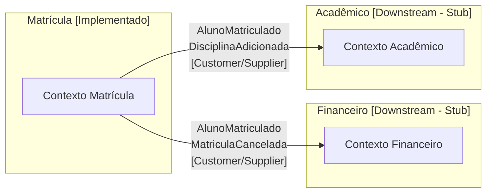

# Architecture Research — DDD Java

**Projeto:** ERP Matrícula (Didático)
**Pesquisado em:** 2026-06-20
**Confiança geral:** HIGH — padrões consolidados em fontes oficiais Spring, Baeldung e literatura DDD canônica

---

## Estrutura de Pacotes Recomendada

### Estrutura Raiz

```
src/main/java/br/com/escola/matricula/
├── dominio/                    # Coração do sistema. Zero dependências externas.
│   ├── matricula/              # Agregado principal — pacote por agregado, não por tipo
│   │   ├── Matricula.java                  # Raiz do agregado (Aggregate Root)
│   │   ├── MatriculaId.java               # Value Object — identidade tipada
│   │   ├── StatusMatricula.java           # Enum de domínio
│   │   ├── ItemMatricula.java             # Entidade interna ao agregado
│   │   └── MatriculaRepositorio.java      # Interface — pertence ao domínio, não à infra
│   ├── aluno/
│   │   ├── AlunoId.java                   # Value Object — referência por ID entre agregados
│   │   └── NomeAluno.java                 # Value Object com validação própria
│   ├── turma/
│   │   ├── TurmaId.java                   # Value Object — referência por ID
│   │   └── VagasDisponiveis.java          # Value Object com regra de negócio
│   ├── shared/
│   │   ├── Cpf.java                       # Value Object compartilhado
│   │   ├── PeriodoLetivo.java             # Value Object compartilhado
│   │   └── EventoDominio.java             # Marker interface — sem Spring
│   └── eventos/
│       ├── AlunoMatriculado.java          # Domain Event (record Java 21)
│       ├── MatriculaCancelada.java        # Domain Event
│       └── DisciplinaAdicionada.java      # Domain Event
│
├── aplicacao/                  # Orquestra o domínio. Usa Spring (anotações de serviço/tx).
│   ├── matricula/
│   │   ├── MatricularAlunoUseCase.java        # Caso de uso — interface (porta de entrada)
│   │   ├── MatricularAlunoHandler.java        # Implementação — orquestra domínio
│   │   ├── CancelarMatriculaUseCase.java
│   │   ├── CancelarMatriculaHandler.java
│   │   ├── AdicionarDisciplinaUseCase.java
│   │   └── AdicionarDisciplinaHandler.java
│   └── dto/
│       ├── MatricularAlunoCommand.java        # Comando de entrada (record imutável)
│       ├── CancelarMatriculaCommand.java
│       ├── AdicionarDisciplinaCommand.java
│       └── MatriculaResumo.java               # DTO de saída (projeção read-only)
│
├── infraestrutura/             # Implementa interfaces do domínio. Depende de tudo.
│   ├── persistencia/
│   │   ├── MatriculaRepositorioMyBatis.java   # Implementa MatriculaRepositorio do domínio
│   │   ├── MatriculaMapper.java               # Interface MyBatis (@Mapper) — SQL puro
│   │   ├── MatriculaRow.java                  # Objeto de persistência (≠ entidade de domínio)
│   │   └── MatriculaRowMapper.java            # Converte MatriculaRow ↔ Matricula (domínio)
│   ├── eventos/
│   │   ├── EventoPublicadorSpring.java        # Publica via ApplicationEventPublisher
│   │   ├── FinanceiroEventoListener.java      # Stub — representa contexto Financeiro
│   │   └── AcademicoEventoListener.java       # Stub — representa contexto Acadêmico
│   └── config/
│       ├── MyBatisConfig.java
│       └── BeanConfig.java                    # Wire: MatriculaRepositorioMyBatis como bean
│
└── interfaces/                 # Borda HTTP. Converte HTTP ↔ Commands/DTOs.
    ├── rest/
    │   ├── MatriculaController.java           # @RestController — delega ao UseCase
    │   ├── MatriculaRequest.java              # Payload JSON de entrada
    │   ├── MatriculaResponse.java             # Payload JSON de saída
    │   └── MatriculaExceptionHandler.java     # @ControllerAdvice — traduz exceções de domínio
    └── mapeamento/
        └── MatriculaDtoMapper.java            # Converte Request ↔ Command, DTO ↔ Response
```

### Rationale para cada nível de pacote

| Pacote | Regra organizadora | Por que não por tipo? |
|--------|-------------------|----------------------|
| `dominio/matricula/` | Por agregado | Coesão: tudo sobre Matrícula fica junto, facilita encontrar o que muda junto |
| `dominio/shared/` | Value Objects sem dono | Cpf e PeriodoLetivo são usados por múltiplos agregados |
| `aplicacao/dto/` | Separado por ser transporte | Commands e DTOs cruzam a fronteira da camada — têm ciclo de vida próprio |
| `infraestrutura/persistencia/` | Por tecnologia | Agrupa tudo que toca banco; facilita trocar MyBatis por JDBC puro se necessário |
| `infraestrutura/eventos/` | Por conceito | Listeners são adaptadores de saída — tecnicamente infra, logicamente "integração" |

---

## Regras de Dependência por Camada

### Diagrama de dependências (setas = "pode depender de")

```
interfaces/ ──────────────────────────────────► aplicacao/
interfaces/                                          │
     │                                               ▼
     └──────────────────────────────────────────► dominio/
                                                      ▲
infraestrutura/ ──────────────────────────────────────┘
infraestrutura/ ──────────────────────────────────► aplicacao/
```

**Regra central: dominio/ não aponta para ninguém.**

### Por camada — o que pode e o que não pode

#### dominio/ — Permitido
- Classes Java puro (POJO / record / enum)
- `java.util.*`, `java.time.*` (Java SE)
- Interfaces de repositório (`MatriculaRepositorio`) — declaradas aqui, implementadas na infra
- Exceções de domínio (`MatriculaInvalidaException extends RuntimeException`)
- Constantes e enums de negócio

#### dominio/ — Proibido
- `import org.springframework.*` — qualquer coisa Spring
- `import org.apache.ibatis.*` — MyBatis
- `import jakarta.persistence.*` — JPA/Hibernate
- Qualquer annotation de framework
- Referências a `MatriculaRow`, `MatriculaMapper` ou qualquer objeto de persistência

#### aplicacao/ — Permitido
- `import org.springframework.stereotype.Service`
- `import org.springframework.transaction.annotation.Transactional` (ver nota abaixo)
- `import jakarta.transaction.Transactional` (alternativa agnóstica)
- Interfaces do domínio (`MatriculaRepositorio`)
- Classes do domínio (Entidades, Value Objects, Domain Events)
- `ApplicationEventPublisher` via injeção de dependência

#### aplicacao/ — Proibido
- `import org.apache.ibatis.*`
- `import org.springframework.web.*` (HTTP é responsabilidade de interfaces/)
- Referências diretas a `MatriculaMapper` ou `MatriculaRow`
- SQL embutido ou qualquer lógica de persistência

#### infraestrutura/ — Permitido
- Tudo. É a camada de adaptação. Pode e deve usar Spring, MyBatis, JDBC, etc.
- Implementar interfaces declaradas em dominio/
- Referenciar entidades de domínio para conversão

#### infraestrutura/ — Proibido
- Lógica de negócio (regras de invariante, decisões de negócio)
- Chamar outros adapters de infraestrutura diretamente (passe pelo domínio/aplicação)

#### interfaces/ — Permitido
- `@RestController`, `@RequestMapping`, `@ControllerAdvice`
- Referenciar casos de uso da camada aplicacao/
- DTOs de entrada/saída (Request/Response JSON)

#### interfaces/ — Proibido
- Lógica de negócio
- Acesso direto ao repositório ou mapper
- Anotações de persistência

### Nota sobre @Transactional

Para máxima pureza arquitetural, use `jakarta.transaction.Transactional` (padrão Jakarta EE) em vez de `org.springframework.transaction.annotation.Transactional` nos handlers da camada aplicacao/. Isso mantém aplicacao/ sem dependência explícita em Spring.

Na prática para este projeto didático, ambos funcionam. Use `jakarta.transaction.Transactional` e explique o motivo no comentário do código — é um ponto pedagógico valioso.

---

## Mapeamento: Arquitetura Tradicional → DDD

Este é o mapa conceitual central do projeto. Para cada artefato familiar, onde ele mora e o que muda.

### Lado a lado: onde cada classe vai

| Arquitetura Tradicional | Pacote tradicional | Equivalente DDD | Pacote DDD | O que mudou |
|------------------------|-------------------|-----------------|------------|-------------|
| `MatriculaController` | `controller/` | `MatriculaController` | `interfaces/rest/` | Igual na forma; delega para UseCase, não para Service. Não contém validação de negócio. |
| `MatriculaService` | `service/` | `MatricularAlunoHandler` | `aplicacao/matricula/` | Renomeado para Use Case; sem lógica de negócio própria — orquestra domínio |
| `MatriculaEntity` | `entity/` ou `model/` | `Matricula` (Aggregate Root) + `MatriculaRow` | `dominio/matricula/` + `infraestrutura/persistencia/` | Separado em dois: modelo de negócio (Domínio) e modelo de persistência (Infra) |
| `MatriculaRepository` (Spring Data) | `repository/` | `MatriculaRepositorio` (interface) | `dominio/matricula/` | A interface permanece no domínio; a implementação vai para infraestrutura/ |
| `MatriculaRepositoryImpl` | `repository/` | `MatriculaRepositorioMyBatis` | `infraestrutura/persistencia/` | Implementação concreta com MyBatis — separada por design |
| `MatriculaDTO` | `dto/` | `MatricularAlunoCommand` + `MatriculaResumo` | `aplicacao/dto/` | Separados: Command (entrada) e DTO de leitura (saída). Sem a mistura de "DTO serve tudo" |
| `@Entity` / `@Column` | sobre a entidade | `MatriculaRow` | `infraestrutura/persistencia/` | Anotações de persistência saem do modelo de negócio completamente |
| *(não existia)* | — | `MatriculaId`, `Cpf`, `PeriodoLetivo` | `dominio/` | Value Objects: tipos ricos que carregam validação e semântica de negócio |
| *(não existia)* | — | `AlunoMatriculado`, `MatriculaCancelada` | `dominio/eventos/` | Domain Events: o domínio narra o que aconteceu, sem acoplar receptores |
| *(não existia)* | — | `MatriculaRowMapper` | `infraestrutura/persistencia/` | Tradução explícita domínio ↔ persistência — intencionalmente visível |

### Exemplo concreto: o fluxo de uma matrícula

```
Tradicional:
POST /matriculas → MatriculaController.criar()
  → MatriculaService.matricular(dto)           # negócio aqui
    → MatriculaRepository.save(entity)         # entity = domínio + persistência misturados

DDD:
POST /matriculas → MatriculaController.matricular(request)
  → converte request → MatricularAlunoCommand
  → MatricularAlunoUseCase.executar(command)   # orquestração apenas
    → MatriculaRepositorio.buscarPorId(id)     # interface do domínio
    → Matricula.matricular(alunoId, turmaId)   # NEGÓCIO AQUI — no domínio
    → registra evento AlunoMatriculado         # domínio narra o fato
    → MatriculaRepositorio.salvar(matricula)   # infra implementa
      → MatriculaMapper.insert(row)            # MyBatis executa SQL
      → Spring publica AlunoMatriculado        # infra despacha eventos
```

**Diferença fundamental:** na arquitetura tradicional, o Service decide. No DDD, o Handler orquestra e o Aggregate decide.

---

## Domain Events — Estratégia de Publicação

### Decisão para este projeto: in-process com Spring ApplicationEvents

**Use Spring ApplicationEventPublisher via infraestrutura, com domínio completamente agnóstico.**

Este é o padrão correto para um projeto de treinamento por três razões:
1. Kafka/RabbitMQ adicionam complexidade operacional sem ganho pedagógico sobre DDD tático
2. Spring ApplicationEvents são síncronos por padrão — comportamento previsível para ensino
3. O padrão é extensível: a mesma estrutura funciona se depois adicionar um broker

### Implementação em três camadas

#### Camada 1: Domínio — coleta eventos, sem Spring

```java
// dominio/shared/EventoDominio.java
public interface EventoDominio {}

// dominio/eventos/AlunoMatriculado.java
public record AlunoMatriculado(
    MatriculaId matriculaId,
    AlunoId alunoId,
    TurmaId turmaId,
    LocalDateTime ocorridoEm
) implements EventoDominio {}

// dominio/matricula/Matricula.java
public class Matricula {
    private final List<EventoDominio> eventos = new ArrayList<>();

    public void matricular(AlunoId alunoId, TurmaId turmaId) {
        // ... invariantes de negócio ...
        eventos.add(new AlunoMatriculado(this.id, alunoId, turmaId, LocalDateTime.now()));
    }

    public List<EventoDominio> coletarEventos() {
        List<EventoDominio> snapshot = List.copyOf(eventos);
        eventos.clear();
        return snapshot;
    }
}
```

O Aggregate Root **não conhece** `ApplicationEventPublisher`. Não há import Spring aqui.

#### Camada 2: Aplicação — publica após persistir

```java
// aplicacao/matricula/MatricularAlunoHandler.java
@Service
public class MatricularAlunoHandler implements MatricularAlunoUseCase {

    private final MatriculaRepositorio repositorio;
    private final ApplicationEventPublisher publicador; // injetado

    @jakarta.transaction.Transactional
    public MatriculaResumo executar(MatricularAlunoCommand command) {
        Matricula matricula = /* ... cria ou busca ... */;
        matricula.matricular(command.alunoId(), command.turmaId());

        repositorio.salvar(matricula);

        // Publica APÓS persistir — garantia de consistência
        matricula.coletarEventos().forEach(publicador::publishEvent);

        return MatriculaResumo.de(matricula);
    }
}
```

#### Camada 3: Infraestrutura — listeners (stubs dos contextos downstream)

```java
// infraestrutura/eventos/FinanceiroEventoListener.java
@Component
@Slf4j
public class FinanceiroEventoListener {

    @EventListener
    public void aoMatricularAluno(AlunoMatriculado evento) {
        // STUB — representa o que o contexto Financeiro faria:
        // emitir boleto, criar contrato financeiro, etc.
        log.info("[Financeiro] Recebeu AlunoMatriculado: aluno={}, matricula={}",
            evento.alunoId(), evento.matriculaId());
        // Em produção real: publicar para Kafka/RabbitMQ aqui
    }
}
```

### Tradeoffs para o projeto de treinamento

| Aspecto | In-process (Spring ApplicationEvent) | Messaging externo (Kafka) |
|---------|--------------------------------------|--------------------------|
| Complexidade operacional | Nenhuma — funciona no mesmo processo | Alta — precisa de broker rodando |
| Comportamento transacional | Síncrono, dentro da transação | Assíncrono, at-least-once delivery |
| Clareza pedagógica | Alta — fluxo rastreável em debugger | Baixa — eventos "desaparecem" do thread |
| Extensibilidade | O listener pode forward para broker depois | N/A |
| Representação do Context Map | `@EventListener` por contexto = visível no código | Tópicos por contexto = configuração externa |

**Conclusão:** Spring ApplicationEvents in-process é a escolha certa para este projeto. Adicionar Kafka seria ruído.

### Alternativa com @TransactionalEventListener

Para casos onde o evento só deve disparar se a transação comprometer com sucesso (evita efeitos colaterais em rollbacks):

```java
@TransactionalEventListener(phase = TransactionPhase.AFTER_COMMIT)
public void aoMatricularAluno(AlunoMatriculado evento) { ... }
```

Recomenda-se usar `@TransactionalEventListener` nos listeners dos stubs — reforça o ponto pedagógico de consistência eventual mesmo em cenário síncrono.

---

## Context Map — Implementação Prática

### Objetivo: representar Financeiro e Acadêmico sem implementá-los

O Context Map existe para ensinar relações entre contextos. A implementação deve tornar as fronteiras visíveis no código sem adicionar complexidade de implementação real.

### Estratégia em três artefatos

#### 1. Diagrama Mermaid (documentação)



#### 2. Package de integração explícito

```
infraestrutura/
└── integracao/
    ├── financeiro/
    │   ├── FinanceiroEventoListener.java     # @EventListener — recebe eventos de Matrícula
    │   └── FinanceiroClienteStub.java        # ACL stub — traduziria para modelo do Financeiro
    └── academico/
        ├── AcademicoEventoListener.java
        └── AcademicoClienteStub.java
```

O pacote `integracao/` por contexto torna a fronteira visível como estrutura de pastas. Um desenvolvedor navegando o projeto encontra a separação de forma natural.

#### 3. Comentários como documentação viva

```java
/**
 * CONTEXTO DOWNSTREAM: Financeiro
 *
 * Relacionamento: Customer/Supplier
 *   - Matrícula (Upstream/Supplier): publica eventos de domínio
 *   - Financeiro (Downstream/Customer): consome e age sobre eles
 *
 * Em produção: este listener publicaria para um tópico Kafka "matricula.eventos"
 * e o serviço Financeiro teria seu próprio consumer. Aqui, o stub simula essa
 * fronteira para fins pedagógicos.
 *
 * Modelo conceitual do Financeiro:
 *   AlunoMatriculado → GerarContrato(alunoId, turmaId, periodo)
 *   MatriculaCancelada → CancelarContrato(matriculaId)
 */
@Component
public class FinanceiroEventoListener {
    @TransactionalEventListener(phase = TransactionPhase.AFTER_COMMIT)
    public void aoMatricularAluno(AlunoMatriculado evento) {
        log.info("[STUB Financeiro] Geraria contrato para aluno {} na matrícula {}",
            evento.alunoId(), evento.matriculaId());
    }
}
```

### O que não fazer

| Anti-padrão | Por que é ruim |
|-------------|----------------|
| Criar packages `financeiro/` e `academico/` como contextos Spring completos | Adiciona complexidade de módulo sem ganho pedagógico |
| Omitir os stubs completamente | Torna o Context Map invisível no código — evento é publicado para ninguém |
| Usar `System.out.println` nos stubs | Não demonstra o padrão correto de logging/observabilidade |
| Colocar os stubs em `dominio/` | Viola dependências — listeners usam Spring (`@Component`, `@EventListener`) |

---

## Ordem de Build Sugerida

A ordem respeita o grafo de dependências: quem não depende de ninguém, vai primeiro.

### Fase 1: Alicerce do Domínio (sem Spring, sem banco)

Construir em ordem, tudo testável como POJO puro:

1. **Value Objects simples:** `MatriculaId`, `AlunoId`, `TurmaId`, `Cpf`, `PeriodoLetivo`
   - Validações internas, imutabilidade, equals/hashCode corretos
   - Ponto pedagógico: tipos ricos vs. `String` e `Long` primitivos

2. **Enums de domínio:** `StatusMatricula` (ATIVA, CANCELADA, TRANCADA)

3. **Entidades internas:** `ItemMatricula` (disciplina adicionada à matrícula)

4. **Domain Events:** `AlunoMatriculado`, `MatriculaCancelada`, `DisciplinaAdicionada`
   - Records Java 21 — imutáveis por design
   - Implementam `EventoDominio` marker interface

5. **Aggregate Root:** `Matricula` com invariantes e coleta de eventos
   - Regras: não pode matricular em turma cheia, não pode adicionar disciplina em matrícula cancelada
   - Coleta eventos em lista interna via `coletarEventos()`

6. **Interface de repositório:** `MatriculaRepositorio`
   - Só declaração — `buscarPorId()`, `salvar()`, `buscarPorAluno()`
   - Não implementa nada — só o contrato que a infra vai honrar

### Fase 2: Casos de Uso (Spring Service, sem banco)

7. **Commands e DTOs:** `MatricularAlunoCommand`, `MatriculaResumo`

8. **Interfaces de Use Case:** `MatricularAlunoUseCase`, `CancelarMatriculaUseCase`, `AdicionarDisciplinaUseCase`

9. **Handlers (implementações):** `MatricularAlunoHandler`, `CancelarMatriculaHandler`, `AdicionarDisciplinaHandler`
   - Testáveis com repositório mockado — domínio funciona completo antes do banco existir

### Fase 3: Infraestrutura de Persistência

10. **Schema SQL:** tabelas `matriculas`, `itens_matricula` (criadas via Flyway ou script manual)

11. **Objeto de persistência:** `MatriculaRow` (POJO mapeado para a tabela — sem herança do domínio)

12. **MyBatis Mapper:** `MatriculaMapper` (interface com `@Mapper` — consultas SQL anotadas)

13. **Conversor:** `MatriculaRowMapper` (converte `MatriculaRow` → `Matricula` e vice-versa)
    - Ponto pedagógico central: a conversão explícita evidencia a separação entre modelos

14. **Implementação do repositório:** `MatriculaRepositorioMyBatis implements MatriculaRepositorio`
    - Usa `MatriculaMapper` + `MatriculaRowMapper`
    - Registrado como `@Repository` — Spring o injeta onde a interface é pedida

### Fase 4: Context Map e Eventos

15. **Publicador de eventos:** configurar `ApplicationEventPublisher` no handler (já disponível via Spring)

16. **Listeners dos contextos downstream:**
    - `FinanceiroEventoListener` — stub com log explicativo
    - `AcademicoEventoListener` — stub com log explicativo

### Fase 5: Interface HTTP

17. **Exceções de domínio mapeadas:** `MatriculaExceptionHandler` (`@ControllerAdvice`)

18. **Request/Response:** `MatriculaRequest`, `MatriculaResponse`

19. **Controller:** `MatriculaController`
    - Três endpoints: `POST /matriculas`, `DELETE /matriculas/{id}`, `POST /matriculas/{id}/disciplinas`

### Por que esta ordem importa pedagogicamente

| Etapa | Por que primeiro |
|-------|-----------------|
| Value Objects antes do Aggregate | Aggregate depende deles; instanciar `Matricula` sem `MatriculaId` não compila |
| Aggregate antes do Use Case | Handler orquestra o Aggregate; escrever handler sem Aggregate é especulativo |
| Interface do repositório no domínio antes da implementação | Força o aluno a ver que o domínio define o contrato, não a infraestrutura |
| Implementação do repositório antes do Controller | Controller sem persistência funcional é difícil de testar manualmente |
| Listeners de domínio antes do Controller | Eventos precisam estar funcionando antes do fluxo completo ser testável de ponta a ponta |

### Implicações de build (Maven)

Para o projeto didático, um único módulo Maven é suficiente. A separação por pacote é suficientemente explícita para o aprendizado sem a complexidade de módulos Maven separados.

Se no futuro for necessário reforçar as fronteiras com o compilador, a separação em módulos seria:
- `matricula-dominio` — sem dependências externas
- `matricula-aplicacao` — depende de `matricula-dominio`
- `matricula-infraestrutura` — depende de ambos + Spring Boot + MyBatis
- `matricula-interfaces` — depende de `matricula-aplicacao`

Para a v1 didática: **um módulo, quatro pacotes, convenção e disciplina**.

---

## Fronteiras de Componentes — Resumo Visual

```
┌─────────────────────────────────────────────────────────────────────┐
│  interfaces/                                                         │
│  ┌─────────────────────────────────┐                                │
│  │ MatriculaController             │  HTTP → Command                │
│  │ @RestController                 │                                │
│  └─────────────────────────────────┘                                │
└────────────────────────┬────────────────────────────────────────────┘
                         │ usa: MatricularAlunoUseCase (interface)
┌────────────────────────▼────────────────────────────────────────────┐
│  aplicacao/                                                          │
│  ┌─────────────────────────────────┐                                │
│  │ MatricularAlunoHandler          │  Command → Domínio → DTO       │
│  │ @Service @Transactional         │                                │
│  └─────────────────────────────────┘                                │
└────────────────────────┬────────────────────────────────────────────┘
                         │ usa: MatriculaRepositorio (interface do domínio)
                         │ usa: Matricula, AlunoId, etc. (tipos do domínio)
┌────────────────────────▼────────────────────────────────────────────┐
│  dominio/                          SEM SPRING. SEM MYBATIS.          │
│  ┌─────────────────────────────────┐                                │
│  │ Matricula (Aggregate Root)      │  Regras de negócio aqui        │
│  │ MatriculaId, AlunoId (VOs)      │                                │
│  │ AlunoMatriculado (Event)        │                                │
│  │ MatriculaRepositorio (interface)│                                │
│  └─────────────────────────────────┘                                │
└─────────────────────────────────────────────────────────────────────┘
                         ▲
                         │ implementa: MatriculaRepositorio
┌────────────────────────┴────────────────────────────────────────────┐
│  infraestrutura/                                                     │
│  ┌─────────────────────────────────┐  ┌──────────────────────────┐ │
│  │ MatriculaRepositorioMyBatis     │  │ FinanceiroEventoListener  │ │
│  │ @Repository                     │  │ AcademicoEventoListener   │ │
│  │ MatriculaMapper (@Mapper)       │  │ @Component @EventListener │ │
│  │ MatriculaRowMapper              │  └──────────────────────────┘ │
│  └─────────────────────────────────┘                                │
└─────────────────────────────────────────────────────────────────────┘
```

---

## Fontes

- [Hexagonal Architecture, DDD, and Spring — Baeldung](https://www.baeldung.com/hexagonal-architecture-ddd-spring) — HIGH confidence
- [DDD and the Hexagonal Architecture — Vaadin Blog](https://vaadin.com/blog/ddd-part-3-domain-driven-design-and-the-hexagonal-architecture) — HIGH confidence
- [Clean DDD Lessons: Project Structure — UNIL Engineering](https://medium.com/unil-ci-software-engineering/clean-ddd-lessons-project-structure-and-naming-conventions-00d0b9c57610) — HIGH confidence
- [Clean DDD Lessons: Transactions with Spring — UNIL Engineering](https://medium.com/unil-ci-software-engineering/clean-ddd-lessons-transactions-with-spring-e78324bfec9a) — HIGH confidence
- [Publishing Domain Events with Spring Data — DEV Community](https://dev.to/peholmst/publishing-domain-events-with-spring-data-53m2) — HIGH confidence
- [DDD Aggregate Roots and Domain Events Publication](https://paucls.wordpress.com/2018/05/31/ddd-aggregate-roots-and-domain-events-publication/) — MEDIUM confidence
- [Spring Data — Publishing Events from Aggregate Roots (oficial)](https://docs.spring.io/spring-data/commons/reference/repositories/core-domain-events.html) — HIGH confidence
- [DDD Bounded Contexts and Java Modules — Baeldung](https://www.baeldung.com/java-modules-ddd-bounded-contexts) — HIGH confidence
- [Strategic DDD by Example: Bounded Contexts Mapping](https://levelup.gitconnected.com/strategic-ddd-by-example-bounded-contexts-mapping-d94ffcd45954) — MEDIUM confidence
- [DDD, Hexagonal, Onion, Clean, CQRS — Herberto Graca](https://herbertograca.com/2017/11/16/explicit-architecture-01-ddd-hexagonal-onion-clean-cqrs-how-i-put-it-all-together/) — HIGH confidence (referência canônica)
