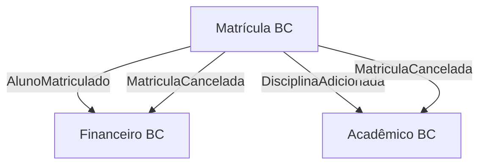

# Features Research — Matrícula Escolar DDD

**Domínio:** Matrícula Escolar (School Enrollment)
**Pesquisado em:** 2026-06-20
**Confiança geral:** HIGH — padrões DDD táticos são bem documentados; regras de negócio específicas derivam do domínio + análise pedagógica

---

## Table Stakes (Must Demonstrate)

Estes padrões DDD DEVEM aparecer no projeto com exemplos claros e documentados. Um projeto de treinamento que omite qualquer um desses não é credível como material DDD.

### 1. Entidades (Entities)

**O que demonstrar:** `Aluno` e `Turma` como entidades com identidade própria. A identidade persiste mesmo quando atributos mudam — um `Aluno` com o mesmo `AlunoId` continua sendo o mesmo aluno mesmo se o nome for corrigido.

**Por que é table stake:** É o primeiro conceito que diferencia DDD de simples mapeamento objeto-relacional. Sem entidades bem definidas, toda a discussão de agregados colapsa.

**Ponto pedagógico obrigatório:** Mostrar que `equals()` e `hashCode()` comparam identidade (`id`), não atributos. Contrastar com POJOs de camada de serviço onde `equals()` usa todos os campos.

**Regra de implementação:** `AlunoId` como tipo próprio (não `Long` ou `UUID` raw), forçando o compilador a rejeitar confusão entre IDs de tipos diferentes.

### 2. Value Objects (Objetos de Valor)

**O que demonstrar:** Mínimo três Value Objects com justificativas distintas:

| Value Object | Por que não é primitivo | Invariante que carrega |
|---|---|---|
| `Cpf` | Validação de dígitos verificadores, formato | CPF inválido nunca existe no domínio |
| `PeriodoLetivo` | Par (ano + semestre) com regras de comparação | Semestre só pode ser 1 ou 2 |
| `NomeDisciplina` | Não pode ser vazio, tem tamanho máximo | Disciplina sem nome é inconsistência |
| `Status` (enum rico) | Transições válidas como comportamento | Status não pode regredir |

**Por que é table stake:** Value Objects são o padrão DDD mais subestimado por quem vem de arquitetura em camadas. Desenvolvedores costumam usar `String cpf` e validar na `@Service`. Demonstrar que a validação mora no construtor do objeto é transformador.

**Ponto pedagógico obrigatório:** Imutabilidade. Mostrar que `Cpf` não tem setters, e que "alterar" um CPF significa criar um novo objeto. Usar `record` do Java 21 onde possível.

**Dependência:** Value Objects devem estar implementados antes de qualquer Entidade ou Agregado.

### 3. Agregado Matrícula (Aggregate)

**O que demonstrar:** `Matricula` como Aggregate Root contendo `List<DisciplinaMatriculada>` (entidade interna). O agregado é a fronteira de consistência — nenhum código externo manipula `DisciplinaMatriculada` diretamente.

**Invariantes a enforçar dentro do agregado:**

| Invariante | Como enforçar | Exceção de domínio |
|---|---|---|
| Matrícula ativa não pode ter zero disciplinas se já teve alguma | Verificação no `cancelar()` — estado intermediário inválido | `MatriculaSemDisciplinasException` |
| Limite máximo de disciplinas por período (ex.: 6) | Verificação no `adicionarDisciplina()` | `LimiteDisciplinasExcedidoException` |
| Não matricular na mesma disciplina duas vezes | Verificação no `adicionarDisciplina()` | `DisciplinaJaMatriculadaException` |
| Matrícula cancelada não aceita novas disciplinas | Guard no início de `adicionarDisciplina()` | `MatriculaCanceladaException` |
| Aluno só pode ter uma matrícula ativa por período | Verificação no Application Service antes de criar | `AlunoJaMatriculadoNoPeriodoException` |

**Por que é table stake:** Agregado é o padrão mais difícil de internalizar. Desenvolvedores de arquitetura em camadas sempre querem quebrar a fronteira e manipular `DisciplinaMatriculada` diretamente pelo repositório. Mostrar que isso viola consistência é o coração do curso.

**Ponto pedagógico obrigatório:** Mostrar o anti-padrão — o que acontece quando alguém faz `disciplinaRepository.save(disciplina)` em vez de `matricula.adicionarDisciplina(disciplina)` e porque o aggregate root perde controle.

### 4. Domain Events (Eventos de Domínio)

**O que demonstrar:** Três eventos emitidos pelo agregado, com consumidores claros (mesmo que simulados):

| Evento | Disparado quando | Consumidor simulado |
|---|---|---|
| `AlunoMatriculado` | `Matricula` é criada | Contexto Financeiro (gera cobrança) |
| `DisciplinaAdicionada` | Disciplina adicionada ao agregado | Contexto Acadêmico (reserva vaga) |
| `MatriculaCancelada` | Matrícula é cancelada | Contexto Financeiro (estorno) + Contexto Acadêmico (libera vaga) |

**Como publicar:** O agregado acumula eventos em uma lista interna (`List<DomainEvent> eventos`). O Application Service, após persistir, delega a publicação. Esta abordagem evita acoplamento direto do domínio com infraestrutura de mensageria.

**Por que é table stake:** Domain Events são o mecanismo central de integração entre Bounded Contexts. Sem eles, o projeto não demonstra como contextos comunicam sem acoplamento direto. São também o que diferencia um sistema reativo de um sistema transacional simples.

**Ponto pedagógico obrigatório:** Mostrar que eventos descrevem o que aconteceu (passado), não comandos (futuro). `MatriculaCancelada` vs `CancelarMatricula`. Mostrar onde o evento é criado (no domínio) vs onde é publicado (na aplicação/infra).

### 5. Repository Pattern (Repositórios)

**O que demonstrar:** Interface no domínio (`MatriculaRepository`), implementação na infraestrutura (`MatriculaRepositoryImpl`). A interface usa tipos de domínio puro; a implementação traduz para/de SQL via MyBatis.

```
domain/
  repository/
    MatriculaRepository.java      ← interface pura, sem import de infra
infrastructure/
  persistence/
    MatriculaRepositoryImpl.java  ← implements MatriculaRepository
    MatriculaMapper.java          ← MyBatis mapper
```

**Por que é table stake:** A inversão de dependência no repositório é o exemplo mais tangível de "domain first" vs "database first". O domínio define o contrato; a infraestrutura obedece. Com MyBatis (não JPA), o mapeamento é explícito e educa sobre a separação real entre modelo de domínio e modelo relacional.

**Ponto pedagógico obrigatório:** Mostrar que `MatriculaRepository` retorna `Optional<Matricula>` (domínio), nunca `MatriculaEntity` (infra). O mapper faz a tradução. Com JPA essa fronteira vaza — é por isso que o projeto usa MyBatis.

### 6. Application Services (Serviços de Aplicação)

**O que demonstrar:** Casos de uso como classes de serviço orquestradoras sem lógica de negócio:

| Caso de Uso | Responsabilidade |
|---|---|
| `MatricularAlunoUseCase` | Verifica elegibilidade, cria `Matricula`, persiste, publica eventos |
| `AdicionarDisciplinaUseCase` | Carrega matrícula, chama `matricula.adicionarDisciplina()`, persiste, publica eventos |
| `CancelarMatriculaUseCase` | Carrega matrícula, chama `matricula.cancelar()`, persiste, publica eventos |

**Regra de ouro a ensinar:** Se o Application Service toma uma decisão de negócio (ex.: "se turma tem mais de X alunos, rejeitar"), está errado. A decisão vai para o domínio. O serviço apenas orquestra.

**Por que é table stake:** Desenvolvedores de arquitetura em camadas colocam toda lógica em `@Service`. Mostrar que Application Service é orchestrator, não business logic container, é uma virada de chave.

### 7. Domain Services (Serviços de Domínio)

**O que demonstrar:** Exatamente um Domain Service com justificativa explícita de por que não está em uma entidade:

`VerificadorElegibilidadeMatricula` — verifica se um `Aluno` pode se matricular em um `PeriodoLetivo`. Esta lógica não pertence a `Aluno` (não tem todos os dados) nem a `Matricula` (ainda não existe). Pertence ao domínio mas atravessa fronteiras de entidades.

**Por que é table stake:** Domain Service é o padrão mais mal-usado. Desenvolvedores criam Domain Services para tudo e acabam com um anemic domain model. Demonstrar quando usar (lógica que não pertence a nenhuma entidade) vs quando não usar (lógica que pertence ao agregado) é pedagogicamente crítico.

**Ponto pedagógico obrigatório:** Comentário explícito no código: "Este comportamento não pertence a Aluno nem a Matricula porque X. Por isso vive aqui."

---

## Features por Caso de Uso

### Caso de Uso 1: Matricular Aluno (`POST /matriculas`)

**Fluxo:**
1. Recebe `MatricularAlunoCommand` com `alunoId` e `periodoLetivoId`
2. Verifica que aluno não tem matrícula ativa no mesmo período (`VerificadorElegibilidadeMatricula`)
3. Cria `Matricula` com status `ATIVA`
4. Persiste via `MatriculaRepository`
5. Publica `AlunoMatriculado`
6. Retorna `MatriculaId`

**Regras de negócio a enforçar:**
- Aluno deve existir (validação de referência)
- Período letivo deve ser válido (não pode matricular em período passado ou inexistente)
- Aluno não pode ter matrícula ativa no mesmo período
- Matrícula criada sem disciplinas é permitida (aluno pode adicionar depois)

**O que demonstrar em DDD:** Factory method no agregado (`Matricula.criar(AlunoId, PeriodoLetivo)`) vs construtor público. O factory encapsula decisões de criação e dispara o evento `AlunoMatriculado`.

### Caso de Uso 2: Adicionar Disciplina (`POST /matriculas/{id}/disciplinas`)

**Fluxo:**
1. Carrega `Matricula` pelo `MatriculaId`
2. Chama `matricula.adicionarDisciplina(disciplinaId, nomeDisciplina)`
3. Agregado verifica todos os invariantes (status, limite, duplicata)
4. Persiste via `MatriculaRepository` (salva o agregado inteiro, não a disciplina isolada)
5. Publica `DisciplinaAdicionada`

**Regras de negócio a enforçar:**
- Matrícula deve existir e estar ativa
- Disciplina não pode já estar na lista
- Não pode exceder o limite máximo de disciplinas por período (6 é um número didaticamente útil)
- Turma com vagas disponíveis (verificação opcional — adiciona complexidade mas demonstra Domain Service cross-aggregate)

**O que demonstrar em DDD:** O repositório salva o AGREGADO completo, não a `DisciplinaMatriculada` isolada. Isso força a discussão de "por que não tenho um `DisciplinaMatriculadaRepository`?"

### Caso de Uso 3: Cancelar Matrícula (`DELETE /matriculas/{id}` ou `PATCH /matriculas/{id}/cancelar`)

**Fluxo:**
1. Carrega `Matricula` pelo `MatriculaId`
2. Chama `matricula.cancelar(motivo)`
3. Agregado verifica invariantes (matrícula ativa, prazo de cancelamento)
4. Status muda para `CANCELADA`, `motivoCancelamento` preenchido
5. Persiste
6. Publica `MatriculaCancelada`

**Regras de negócio a enforçar:**
- Apenas matrículas `ATIVAS` podem ser canceladas (tentativa em `CANCELADA` lança exceção de domínio)
- Cancelamento com motivo (obrigatório — demonstra que o domínio captura intenção)
- Cancelamento pode ter prazo (se após data X, só com justificativa administrativa) — complexidade opcional

**O que demonstrar em DDD:** Transição de estado como comportamento do domínio. `matricula.cancelar()` não é um setter — é um comando que transita estado e emite evento. Comparar com o anti-padrão `matricula.setStatus("CANCELADA")`.

---

## Diferenciadores Pedagógicos

### 1. Comparação Lado a Lado: Arquitetura em Camadas vs DDD

Para cada padrão DDD implementado, incluir documentação mostrando como o mesmo problema seria resolvido na arquitetura em camadas e por que a solução DDD é superior no contexto de domínios complexos.

**Exemplo concreto a incluir:**

```
// ANTES — Arquitetura em Camadas (MatriculaService.java)
public void adicionarDisciplina(Long matriculaId, String disciplinaId) {
    Matricula matricula = repo.findById(matriculaId);
    if (matricula.getStatus().equals("CANCELADA")) throw new Exception("...");
    if (matricula.getDisciplinas().size() >= 6) throw new Exception("...");
    DisciplinaMatriculada d = new DisciplinaMatriculada();
    d.setDisciplinaId(disciplinaId);
    disciplinaRepo.save(d);  // viola fronteira do agregado
}

// DEPOIS — DDD (AdicionarDisciplinaUseCase.java)
public void executar(AdicionarDisciplinaCommand cmd) {
    Matricula matricula = matriculaRepository.buscarPorId(cmd.matriculaId())
        .orElseThrow(MatriculaNaoEncontradaException::new);
    matricula.adicionarDisciplina(cmd.disciplinaId(), cmd.nomeDisciplina());
    matriculaRepository.salvar(matricula);
    publicarEventos(matricula.coletarEventos());
}
// Invariantes vivem no domínio, não no serviço
```

**Dependência:** Esta seção de documentação deve existir para os três casos de uso.

### 2. Exceções de Domínio com Semântica Rica

Usar exceções de domínio tipadas ao invés de exceções genéricas. Cada exceção carrega o contexto do invariante violado:

- `MatriculaCanceladaException` — tentativa de operação em matrícula encerrada
- `LimiteDisciplinasExcedidoException(int limite, int atual)` — inclui valores para feedback rico
- `DisciplinaJaMatriculadaException(DisciplinaId disciplinaId)` — identifica qual disciplina conflita
- `AlunoJaMatriculadoNoPeriodoException(AlunoId alunoId, PeriodoLetivo periodo)` — contexto completo

**Por que diferencia:** Projetos CRUD genéricos lançam `RuntimeException("Erro de validação")`. Exceções de domínio tipadas são auto-documentáveis, testáveis e comunicam intenção.

### 3. Linguagem Ubíqua Aplicada Consistentemente no Código

O código usa termos do domínio sem tradução para inglês técnico. Isso é incomum em projetos Java e cria um ponto pedagógico tangível:

- `matriculaRepository.buscarPorId()` (não `findById`)
- `matricula.adicionarDisciplina()` (não `addCourse`)
- `Matricula.criar()` (não `MatriculaFactory.build()`)
- DTOs chamados `MatricularAlunoCommand`, `DisciplinaAdicionadaEvent`

**Por que diferencia:** A maioria dos projetos Java usa inglês técnico mesmo para domínios em português, quebrando a coerência entre a linguagem dos especialistas de domínio e o código. Mostrar que o código pode falar a língua do negócio é revelador.

### 4. ADRs (Architecture Decision Records) Pedagógicos

Não apenas "decidimos usar MyBatis" — mas por que a decisão serve ao aprendizado:

| ADR | Decisão | Lição DDD |
|---|---|---|
| ADR-001 | MyBatis em vez de JPA | JPA vaza abstrações de persistência no domínio via annotations; MyBatis força separação explícita |
| ADR-002 | Apenas Bounded Context Matrícula implementado | Contextos integrados adicionam complexidade de integração antes que padrões táticos sejam consolidados |
| ADR-003 | Referência por ID entre agregados | Carregar o objeto completo (`Aluno` dentro de `Matricula`) cria acoplamento e viola fronteiras de consistência |
| ADR-004 | Código em português | Linguagem Ubíqua não é opcional — tradução cria uma barreira cognitiva entre negócio e código |

**Por que diferencia:** Projetos de exemplo raramente explicam por que foram construídos dessa forma. ADRs pedagógicos transformam decisões em aulas.

### 5. Mapa de Conceitos DDD para Arquivos Concretos

Documento final que mapeia cada conceito DDD abstrato para o arquivo concreto que o exemplifica:

```
Aggregate Root   → src/main/java/br/.../domain/Matricula.java
Value Object     → src/main/java/br/.../domain/vo/Cpf.java
Domain Event     → src/main/java/br/.../domain/event/AlunoMatriculado.java
Repository (IF)  → src/main/java/br/.../domain/repository/MatriculaRepository.java
Repository (IMPL)→ src/main/java/br/.../infrastructure/MatriculaRepositoryImpl.java
```

**Por que diferencia:** Desenvolvedores estudando DDD frequentemente sabem a teoria mas não conseguem localizar o padrão no código. Este mapa elimina a distância entre conceito e implementação.

### 6. Context Map com Eventos Reais (Mermaid)

Mostrar Bounded Contexts vizinhos (Financeiro, Acadêmico) no Context Map mesmo que não implementados, com os eventos que cruzam as fronteiras. Isso demonstra o valor de Domain Events como mecanismo de integração loose-coupled.



---

## Anti-Features

### 1. Autenticação e Autorização

**Por que excluir:** Generic Domain. Adiciona `@PreAuthorize`, JWT filters e configurações de segurança que diluem o foco nos padrões táticos DDD. Um desenvolvedor estudando DDD passa metade do tempo configurando Spring Security.

**O que fazer em vez disso:** Mencionar em um ADR que auth foi excluído deliberadamente e que em produção seria um Generic Subdomain implementado como cross-cutting concern.

### 2. Contextos Financeiro e Acadêmico Implementados

**Por que excluir:** Implementar integração entre Bounded Contexts (via mensageria, REST ou eventos assíncronos) introduz complexidade de infraestrutura que obscurece os padrões táticos. A aula principal é DDD tático — a integração entre contextos é DDD estratégico avançado.

**O que fazer em vez disso:** Event listeners simulados que apenas loggam o evento recebido, demonstrando o mecanismo sem implementar o consumidor real. Suficiente para mostrar o contrato de integração.

### 3. CQRS (Command Query Responsibility Segregation)

**Por que excluir:** CQRS é frequentemente associado a DDD mas é um padrão independente que adiciona complexidade de modelos de leitura separados. Para um projeto didático de DDD tático, introduz overhead cognitivo antes que os fundamentos estejam consolidados.

**O que fazer em vez disso:** Queries simples no repositório (`buscarMatriculaPorId`, `listarMatriculasDoAluno`) sem separação de modelo de leitura. Mencionar CQRS como extensão natural em um roadmap de evolução.

### 4. Event Sourcing

**Por que excluir:** Event Sourcing é avançado e muda fundamentalmente como o estado é persistido. Confunde desenvolvedores que ainda estão aprendendo o que é um Domain Event. É frequentemente confundido com "ter Domain Events" — separar as duas ideias é pedagogicamente importante.

**O que fazer em vez disso:** Um parágrafo explicando que Domain Events não implicam Event Sourcing. O projeto usa Domain Events com persistência de estado convencional (snapshot atual no banco).

### 5. Testes Automatizados Completos (na fase inicial)

**Por que excluir (inicialmente):** O projeto tem um objetivo pedagógico de clareza de código de produção. Adicionar cobertura de testes completa dobra o volume de código e o iniciante em DDD fica dividido entre entender o padrão e entender o teste.

**O que fazer em vez disso:** Alguns testes unitários exemplares para o agregado (invariantes do `Matricula`), suficientes para mostrar que domínio puro é altamente testável. A testabilidade como benefício do DDD deve ser apontada, não o projeto completo de testes.

### 6. Factories Explícitas (DDD Factory Pattern)

**Por que excluir:** Factory como classe separada (`MatriculaFactory`) adiciona um conceito a mais sem ganho proporcional em um domínio dessa escala. Factory methods estáticos no próprio agregado (`Matricula.criar()`) cobrem o padrão adequadamente.

**O que fazer em vez disso:** Factory methods no Aggregate Root, com comentário explicando que em domínios mais complexos a lógica de criação pode merecer uma Factory class dedicada.

### 7. Specifications Pattern

**Por que excluir:** Specification é útil para queries complexas e combinação de regras, mas adiciona abstração que não é table stake para DDD tático básico. Pode ser confundido com validação simples.

**O que fazer em vez disso:** Regras de elegibilidade como métodos no Domain Service (`VerificadorElegibilidadeMatricula`), com menção de que o padrão Specification seria adequado se as regras precisassem ser combinadas dinamicamente.

---

## Complexity Assessment

### Alta Complexidade (implementar com atenção extra e documentação densa)

| Feature | Por que é complexa | Mitigação |
|---|---|---|
| Aggregate com invariantes encadeados | A ordem de verificação dos invariantes importa; erro em um pode mascarar outro | Testes unitários do agregado com cenários explícitos para cada invariante |
| Domain Events com coleta e publicação | Separar criação do evento (domínio) de publicação (infra) sem acoplar | Documentar o ciclo de vida do evento com diagrama de sequência |
| MyBatis mapping sem vazar infra no domínio | Tentação de adicionar annotations JPA no modelo de domínio | Mappers separados com ResultMap explícito; domínio sem nenhuma annotation de persistência |
| Referência por ID entre agregados | Desenvolvedores querem navegar `matricula.getAluno()` e ficam confusos com lazy load ausente | ADR explicando a decisão; Application Service carrega os dois quando necessário |

### Média Complexidade (implementar com documentação padrão)

| Feature | Por que é média | Observação |
|---|---|---|
| Value Objects com validação | Java `record` simplifica; a complexidade está em decidir quais regras ficam aqui | CPF tem algoritmo específico — documentar o algoritmo com referência |
| Application Service orquestrando sem lógica | Tentação de colocar lógica — requer disciplina e code review | Comentários inline marcando "esta decisão pertence ao domínio" |
| Exceções de domínio hierarquia | Hierarquia razoável sem over-engineering | `MatriculaDomainException` como base com especializações |

### Baixa Complexidade (implementar sem preocupação especial)

| Feature | Por que é simples | Observação |
|---|---|---|
| Controllers REST | Delegam para Application Service; sem lógica | Validação de entrada com Bean Validation padrão |
| DTOs / Commands | Records do Java 21; imutáveis por padrão | Separação clara: Command entra, DTO sai |
| Docker Compose | PostgreSQL + App; configuração padrão | Script de seed do banco para demonstração |
| Documentação Mermaid | Diagramas de classe e sequência inline no Markdown | Priorizar diagramas que mostram fluxos de eventos |

---

## Dependências entre Features

```
Value Objects
    └──> Entidades (Aluno, Turma usam Cpf, PeriodoLetivo)
         └──> Agregado Matrícula (usa entidades + VOs)
              └──> Domain Events (emitidos pelo agregado)
                   └──> Repository Interface (domínio)
                        └──> Application Services (orquestram tudo)
                             └──> Domain Service (chamado pelos use cases)
                                  └──> Controllers REST (interface entry point)
```

**Ordem de implementação recomendada:**
1. Value Objects (base de tudo)
2. Entidades simples (Aluno, Turma como stubs — só id e nome)
3. Agregado Matrícula com invariantes (sem persistência ainda)
4. Testes unitários do agregado (valida invariantes antes de tocar banco)
5. Repository interface + implementação MyBatis
6. Application Services
7. Domain Service de elegibilidade
8. Controllers REST
9. Domain Events + publicação

---

## Fontes

- [Application Services VS Domain Services in DDD](https://medium.com/@jankrloz/application-services-vs-domain-services-in-ddd-7846dcbd7f95)
- [DDD Aggregates in Practice](https://medium.com/@aforank/domain-driven-design-aggregates-in-practice-bcced7d21ae5)
- [Uncovering Hidden Business Rules with DDD Aggregates](https://medium.com/nick-tune-tech-strategy-blog/uncovering-hidden-business-rules-with-ddd-aggregates-67fb02abc4b)
- [Repository Pattern in DDD](https://www.abrahamberg.com/blog/repository-pattern-in-ddd-bridging-the-domain-and-data-models/)
- [DDD Part 2: Tactical Domain-Driven Design — Vaadin](https://vaadin.com/blog/ddd-part-2-tactical-domain-driven-design)
- [DDD and Hexagonal Architecture — Vaadin](https://vaadin.com/blog/ddd-part-3-domain-driven-design-and-the-hexagonal-architecture)
- [Modelling Aggregates: Invariants vs Corrective Policies](https://domaincentric.net/blog/modelling-business-rules-invariants-vs-corrective-policies)
- [Value Object — Martin Fowler](https://martinfowler.com/bliki/ValueObject.html)
- [DDD Aggregate Roots and Domain Events](https://paucls.wordpress.com/2018/05/31/ddd-aggregate-roots-and-domain-events-publication/)
- [Domain-Driven Design with Java — O'Reilly](https://www.oreilly.com/library/view/domain-driven-design-with/9781800560734/)
