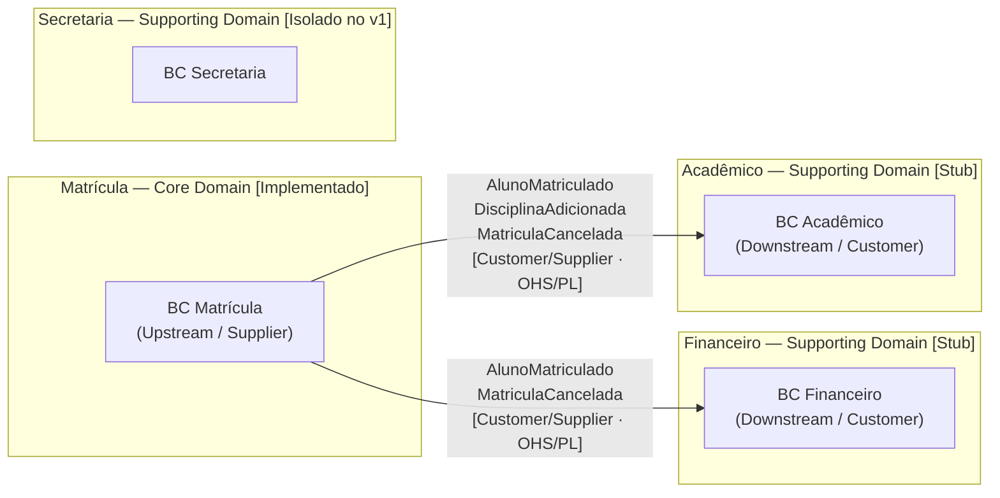

# Context Map — Matrícula Escolar

O Context Map mostra como os Bounded Contexts se relacionam — quem depende de quem, qual lado define o contrato e quais eventos cruzam as fronteiras. É a visão estratégica de integração do sistema: não descreve como cada contexto funciona internamente, mas como eles conversam e quem tem autoridade sobre cada parte do contrato de comunicação.

---

## Diagrama

> **Secretaria:** aparece como contexto separado mas não recebe eventos de Matrícula no v1. Ver [Secretaria no v1](#secretaria-no-v1).

---

## Padrões de Relacionamento

### Customer/Supplier (Cliente/Fornecedor)

Matrícula é o contexto **upstream** (Supplier): define os eventos que outros contextos podem consumir. A equipe que desenvolve Matrícula não precisa conhecer nem consultar Financeiro ou Acadêmico para publicar seus eventos — o contrato flui em uma única direção.

Financeiro e Acadêmico são contextos **downstream** (Customer): adaptam seu comportamento quando recebem eventos de Matrícula. Se Matrícula mudar a estrutura de um evento, Financeiro e Acadêmico precisam se adaptar — e não o contrário.

Em termos práticos: a equipe do BC Matrícula "fornece" os eventos; as equipes de Financeiro e Acadêmico "consomem" esses eventos e modelam seus domínios em torno deles. A negociação de contrato acontece quando o Supplier decide evoluir sua interface pública.

### Open Host Service (OHS)

O BC Matrícula expõe um conjunto de eventos bem definido como sua **interface pública**. Qualquer contexto que queira integrar com Matrícula usa esses eventos — não acessa o banco de dados de Matrícula diretamente, não chama métodos internos dos seus objetos de domínio, não lê suas tabelas SQL.

Essa interface é estável e intencionalmente versionável: quando Matrícula precisa evoluir internamente (refatorar sua estrutura de dados, adicionar campos ao Aggregate), pode fazer isso sem quebrar os consumidores, desde que a interface pública dos eventos seja preservada.

O OHS é o padrão que transforma um Bounded Context isolado em um participante cooperativo do ecossistema — sem criar acoplamento estrutural.

### Published Language (PL)

Os eventos `AlunoMatriculado`, `DisciplinaAdicionada` e `MatriculaCancelada` são a **linguagem publicada** (Published Language): contratos documentados que o BC Matrícula se compromete a manter. Contextos downstream constroem sua lógica em cima desses contratos.

A Published Language complementa o Open Host Service: o OHS define que "existe uma interface pública"; a PL define o que essa interface contém — os campos, os tipos, a semântica de cada campo. Por exemplo, `AlunoMatriculado` carrega `alunoId`, `turmaId`, `periodoLetivo` e `timestamp` — e isso é um contrato, não um detalhe de implementação.

### Anti-Corruption Layer (ACL)

Financeiro e Acadêmico implementam uma **ACL** ao receber eventos de Matrícula: traduzem os dados do evento para seus próprios conceitos internos.

Exemplo concreto: ao receber `AlunoMatriculado`, o BC Financeiro não cria um objeto `Matricula` interno — ele cria um `Contrato` com um `alunoId` (UUID) e uma `DataVigencia` derivada do `periodoLetivo`. O modelo de Matrícula não "contamina" o domínio financeiro; os dados são traduzidos para a linguagem do BC Financeiro.

A ACL protege a autonomia de cada contexto: Financeiro pode evoluir seu modelo de domínio sem depender de como Matrícula estrutura os seus dados internamente, porque a tradução acontece na camada de anticorrupção.

---

## Eventos que Cruzam Fronteiras

| Evento | Publicado por | Consumido por | Propósito |
|--------|--------------|---------------|-----------|
| `AlunoMatriculado` | BC Matrícula | BC Financeiro, BC Acadêmico | Financeiro cria o contrato financeiro do aluno para o período; Acadêmico cria o vínculo acadêmico do aluno |
| `DisciplinaAdicionada` | BC Matrícula | BC Acadêmico | Acadêmico reserva a vaga do aluno na disciplina e prepara o registro de frequência e notas |
| `MatriculaCancelada` | BC Matrícula | BC Financeiro, BC Acadêmico | Financeiro cancela ou suspende o contrato financeiro; Acadêmico libera as vagas nas disciplinas do aluno |

Os três eventos cobrem o ciclo de vida completo da matrícula do ponto de vista dos contextos consumidores: criação (`AlunoMatriculado`), evolução (`DisciplinaAdicionada`) e encerramento (`MatriculaCancelada`).

---

## Secretaria no v1

A Secretaria existe como subdomínio separado com responsabilidades próprias — emissão de documentos, comunicados, agendamentos de atendimento, registros de protocolo. É um contexto com identidade e linguagem próprias.

No v1 deste projeto, não há eventos de Matrícula que gerem ações de Secretaria no escopo definido. A ausência de setas no diagrama é intencional, não uma omissão. Operacionalmente, uma integração faz sentido: `AlunoMatriculado` poderia gerar a emissão automática de uma declaração de matrícula, ou `MatriculaCancelada` poderia acionar um protocolo de desligamento. Essas integrações seriam escopo de v2 — implementá-las no v1 adicionaria complexidade de integração sem acrescentar conceitos pedagógicos novos sobre DDD tático.

Ver [Bounded Contexts — BC Secretaria](bounded-contexts.md#bc-secretaria-supporting--isolado-no-v1) para o contexto completo da decisão.
