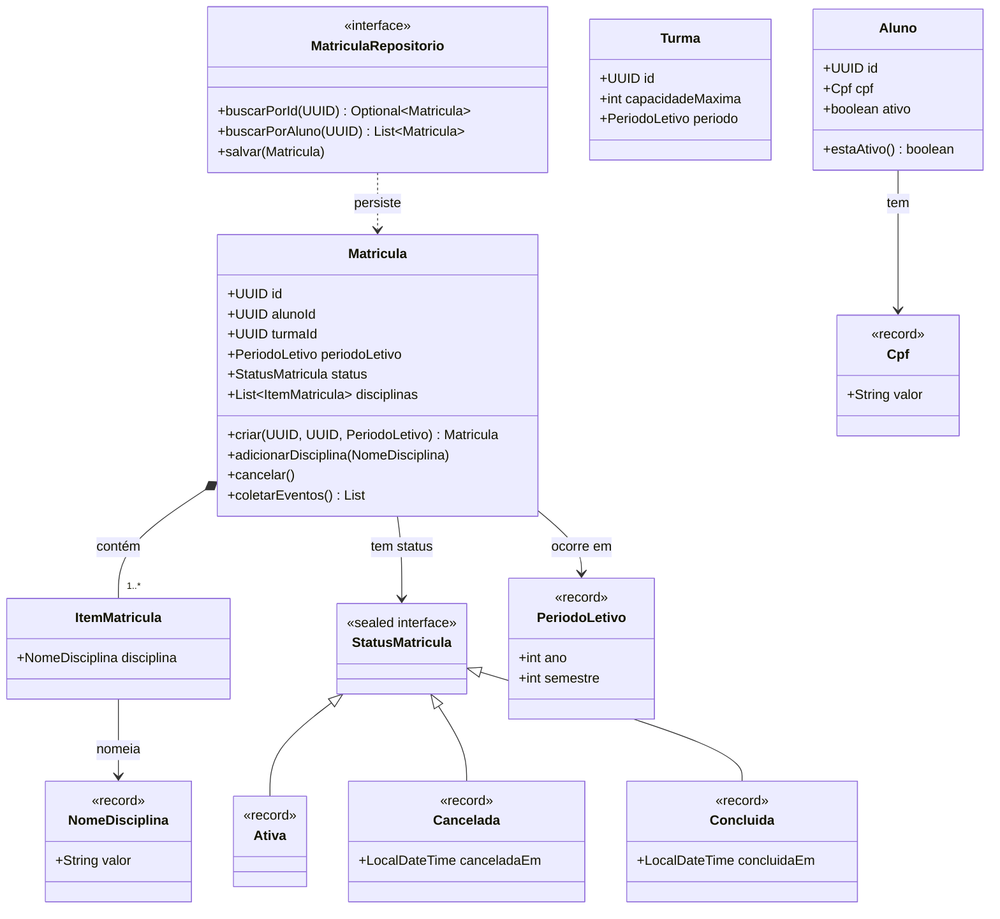
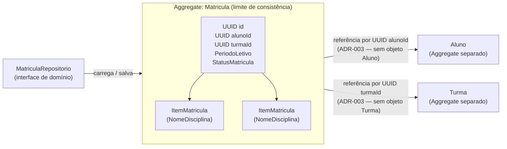
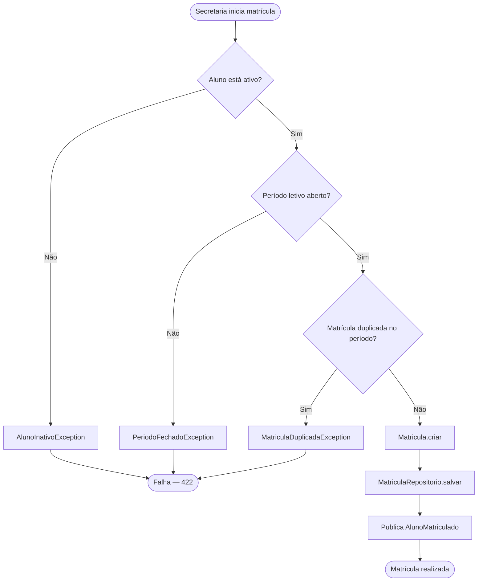
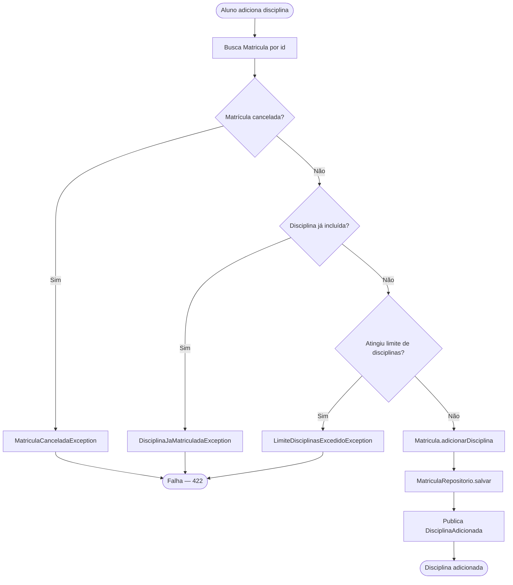
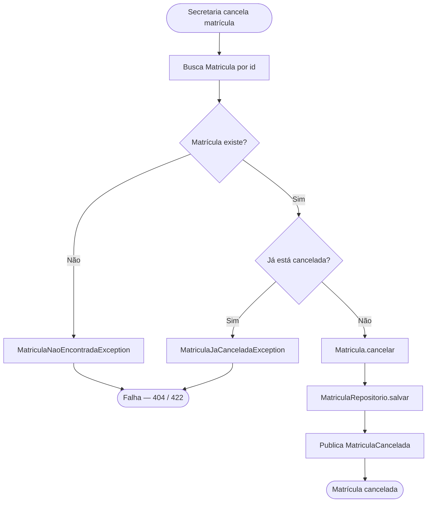
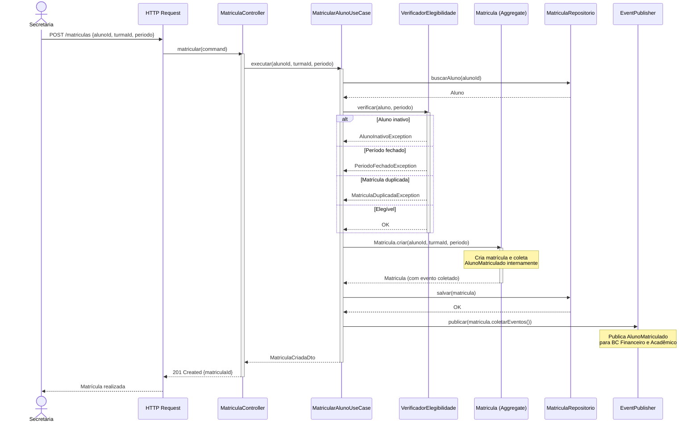

# Modelagem Visual — Matrícula Escolar

Este documento é o mapa visual do modelo de domínio documentado nos seis arquivos táticos anteriores: [value-objects.md](./value-objects.md), [entidades.md](./entidades.md), [agregados.md](./agregados.md), [domain-services.md](./domain-services.md), [domain-events.md](./domain-events.md) e [repositorios.md](./repositorios.md). Não é redundante — é uma perspectiva diferente do mesmo modelo. A prosa descreve o raciocínio; os diagramas mostram a estrutura e o fluxo de uma vez só.

Cada diagrama responde uma pergunta diferente sobre o mesmo domínio: o diagrama de classes mostra quais tipos existem e como se relacionam; o diagrama de agregados mostra os limites de consistência; os flowcharts mostram os caminhos de negócio com suas exceções; o sequence diagram mostra como os objetos colaboram em tempo de execução.

Use este documento como referência rápida depois de ter lido os seis arquivos táticos — e como ponto de entrada visual se ainda não os leu. Cada diagrama inclui links para o documento que detalha o que você está vendo.

---

## MOD-01: Diagrama de Classes

O diagrama de classes mostra todos os elementos do domínio de Matrícula e seus relacionamentos estáticos. Observe que `Matricula` referencia o aluno e a turma por `UUID` — não pelos objetos `Aluno` e `Turma` — implementando [ADR-003](../adrs/ADR-003-referencia-por-id.md). `StatusMatricula` é uma `sealed interface` com três implementações como `record` — ver [agregados.md](./agregados.md).

> **O que observar:** `Matricula` armazena `alunoId` e `turmaId` como `UUID` — não como objetos `Aluno` e `Turma`. Esse é o padrão de referência por ID (ADR-003) visualizado. Domain Events não aparecem aqui — estão no sequence diagram.

---

## MOD-02: Diagrama de Agregados

O diagrama de agregados mostra os limites do Aggregate `Matricula` — o que está dentro (controlado pelo Aggregate Root) e o que é referenciado por ID fora do limite de consistência. Compare com o diagrama de classes: o de classes mostra tipos; este mostra fronteiras de consistência. Ver [agregados.md](./agregados.md) para o raciocínio de por que esses limites existem.

> **Limite de consistência:** Tudo dentro do `subgraph` é carregado e salvo atomicamente pelo `MatriculaRepositorio`. `Aluno` e `Turma` são Aggregates separados — cada um com seu próprio Repositório (que não é implementado no v1).

---

## MOD-03: Flowcharts de Negócio

Os três fluxos de negócio mostram o caminho feliz e os caminhos de erro para cada caso de uso. Os diamantes `{}` representam as invariantes do Aggregate verificadas em `adicionarDisciplina()`, `cancelar()` e `Matricula.criar()` — ver [agregados.md](./agregados.md). Cada exceção nomeada mapeia para uma exceção de domínio tipada.

### Fluxo 1: Realizar Matrícula

### Fluxo 2: Adicionar Disciplina

### Fluxo 3: Cancelar Matrícula

> **Nota:** Os nomes de exceção nos fluxos (`AlunoInativoException`, `LimiteDisciplinasExcedidoException`, etc.) correspondem às exceções tipadas documentadas em [agregados.md](./agregados.md). Em HTTP, elas resultam em respostas 422 (violação de invariante) ou 409 (conflito) — mapeamento detalhado na Fase 4.

---

## MOD-04: Sequence Diagram — Realizar Matrícula

O sequence diagram mostra o fluxo completo de "Realizar Matrícula" do ponto de vista técnico: como os objetos colaboram, em que ordem, e onde cada regra de negócio é verificada. A passagem pelo `VerificadorElegibilidadeMatricula` antes de `Matricula.criar()` implementa a separação Domain Service (regra cross-entidade) / Aggregate (invariantes internas) documentada em [domain-services.md](./domain-services.md).

> **O fluxo completo:** Este sequence diagram é o success criteria da fase — "um desenvolvedor acompanha o fluxo do início ao fim e consegue descrever cada passo". Use-o como referência ao ler o código da Fase 3.
